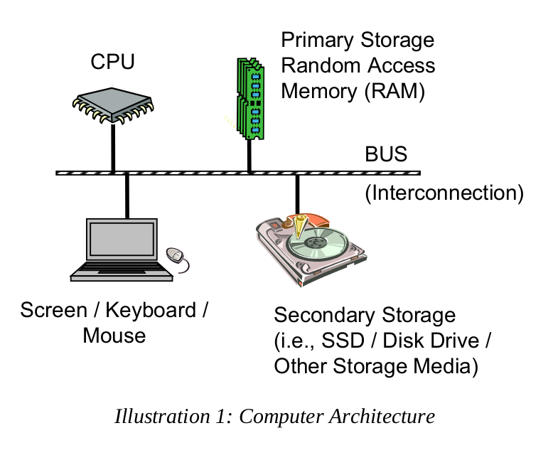

## $\textnormal{Architecture Overview}$

> - The basic components of computer include a `Central Processing Unit (CPU)`,  
    `Primary Storage` or `Random Access Memory (RAM)`, `Secondary Storage`,  
    `Input/Output devices` (screen, keyboard, mouse, etc.), and an interconnection  
    referred to as the `Bus`.

 

| Computer Architecture |
| ------------------------------------- |
|  |

 

> - The architecture is typically referred to as the `Von Neumann Architecture`,  
    or the `Princeton Architecture`, and was described in 1945 by the  
    mathematician and physicist `John Von Neumann`.

> - Programs and data are typically stored on secondary storage (disk drive  
    or solid state drive).

> - When a program is executed, it must be copied from secondary storage  
    into the primary storage or main memory (RAM).

> - The `CPU` executes the program from the primary storage or `RAM`.

> - Primary storage or main memory is also referred to as volatile memory  
    since when power removed, the information is not retained and thus  
    lost.

> - Secondary storage is referred to as non-volatile memory since the information  
    is retained when powered off.

> - For example, consider storing a term paper on secondary storage (disk, etc.).

> - When the user starts to write or edit the term paper, it is copied from the  
    secondary storage medium into primary storage (RAM or main memory).

> - When done, the updated version is typically stored back to the secondary  
    storage (disk).

> - If you have ever lost power while editing a document, losing the unsaved  
    work will certainly clarify the difference between volatile and  
    non-volatile memory.
