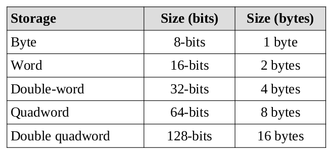
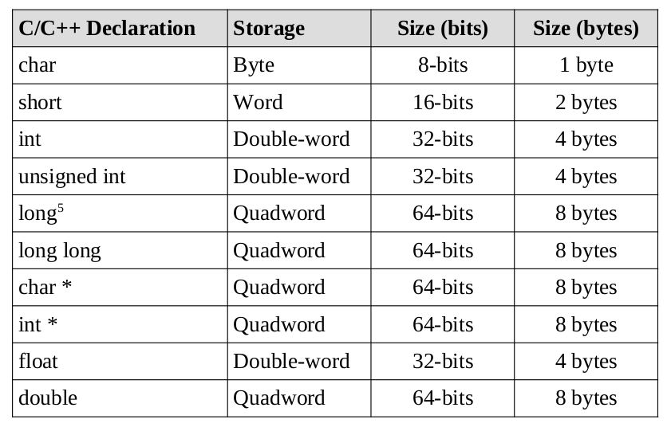

## $\textnormal{Data Storage Sizes}$

> - The `x86-64` architecture supports a specific set of data storage  
    size elements, all based on power of two.

> - The supported storage sizes are as follows.

 

| Supported Storage Sizes |
| ----------------------- |
|  |

 

> - Lists or arrays (sets of memory) can be reserved in any of these types.

> - These storage sizes have a direct correlation to variable declarations  
    in high-level languages (C, C++, Java, etc.).

> - For example, C/C++ declarations are mapped as follows:

 

| C/C++ Mapped Declarations |
| ------------------------- |
|  |

 

> - The asterisk indicates an address variable.

> - For example, `int *` means the address of an integer.
