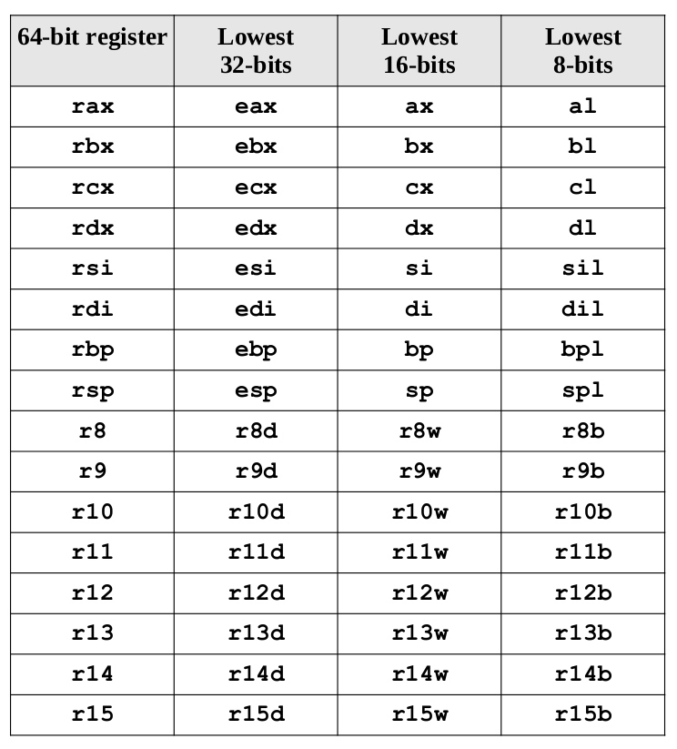
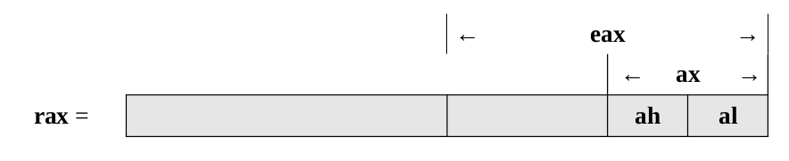

## $\textnormal{General Purpose Registers (GPRs)}$

> - There are sixteen, 64-bit GPRs.

> - A `GPR` register can be accessed with all 64-bits or some <br />
    portion or subset accessed.

<br />

| General Purpose Registers (GPRs) |
| -------------------------------- |
|  |

<br />

> - When using data element sizes less than `64-bits` (i.e., 32-bit, 16-bit, or 8-bit), <br />
    the lower portion of the register can be accessed by using a different register <br />
    name.

> - When accessing the lower portion of the 64-bit `rax` register, the layout is <br />
    as follows:

<br />

| Lower Portion of 64-bit rax register |
| ------------------------------------ |
|  |

<br />

> - As shown in the diagram, the first registers, `rax`, `rbx`, `rcx`, and `rdx` <br />
    also allow the bits 8-15 to be accessed with the `ah`, `bh`, `ch`, and `dh` <br />
    register names.

> - With the exception of `ah`, these are provided for legacy support and will <br />
    not be used in this text.

> - The ability to access portions of the register means that, if the quadword <br />
    `rax` register is set to `50,000,000,000`<sub>10</sub> (fifty billion), the <br />
    `rax` register would contain the following value in hex.

```plaintext
50,000,000,000 (decimal) = 1011 1010 0100 0011 1011 0111 0100 0000 0000 (binary)

Hexadecimal Equivalent:
1011 -> B
1010 -> A
0100 -> 4
0011 -> 3
1011 -> B
0111 -> 7
0100 -> 4
0000 -> 0
0000 -> 0
```

```plaintext
rax = 0000 000B A43B 7400
```

> - If a subsequent operation sets the word `ax` register to `50,000`<sub>10</sub> <br />
    (fifty thousand, which is C350<sub>16</sub>), the `rax` register would contain <br />
    the following value in hex.


```plaintext
rax = 0000 000B A43B C350
```

> - In this case, when the lower 16-bit `ax` portion of the 64-bit `rax` register <br />
    is set, the upper 48-bits are unaffected.

> - Note the change in `AX` (from 7400<sub>16</sub> to C350<sub>16</sub>).

> - When the lower 8-bit `al` portion of the 64-bit `rax` register is set, the <br />
    upper 56-bits are unaffected.

> - Note the change in `AL` (from 50<sub>16</sub> to 32<sub>16</sub>).

> - For 32-bit register operations, the 32-bits is cleared (set to zero).

> - Generally, this is not an issue since operations on 32-bit registers do not <br />
    use the upper 32-bits of the register.

> - For unsigned values, this can be useful to convert from 32-bits to 64-bits.

> - However, this will not work for signed conversions from 32-bit to 64-bit values.

> - Specifically, it will potentially provide incorrect results for negative values.
