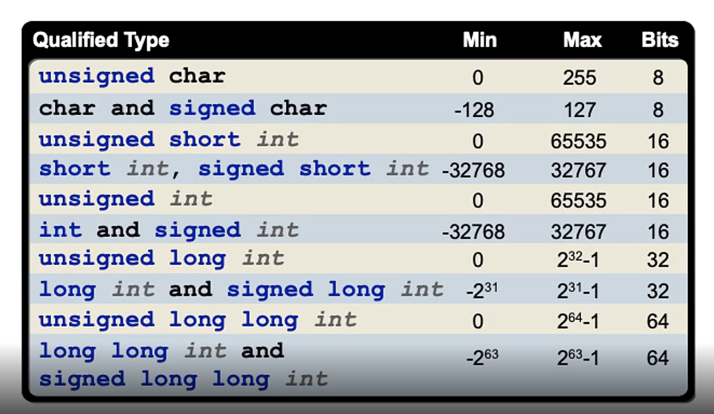

## Variable Types

> - Variables consist of type and identifier (name).

> - Part of the ANSI C standard.

> - Implementation can be compiler specific.

> - Initialized before your code.

<br />

| Sample Codes |
| ------------ |
| [Code Variable Types](./code-variable-types.c) |


<br />
<br />


## Data Types and Qualifiers

<br />

| Types |
| ----- |
|  |

<br />

> - `Note`: The `char` is considered an integer type.

```c
char num_1 = 1;
signed char num_2 = -128;
```

> - For instance, for some compilers the `int` have different bits.

```c
// XC16 compiler.
// Link: https://developerhelp.microchip.com/xwiki/bin/view/software-tools/xc16/install/
// All check the compiler manual.
int = 16 bits
int = 18 bits
int = 32 bits ???
```

<br />
<br />


## Data Qualifiers

> - All data types have qualifiers.

> - It always has `Signed` or `Unsigned` qualifier.

> - Or `Short` or `Long` qualifier.

> - Qualifier change the physical `size` and range of the data type.

> - If qualifier are not specified, the compiler will decide what <br />
    qualifier to choose.

<br />
<br />


## Data Type Qualifiers

> - In `XC16` compiler, if you did not specify the qualifier, it <br />
    will assume that you wanted a `signed`, `short`, and `integer`.

```c
int x = signed short int x
```
