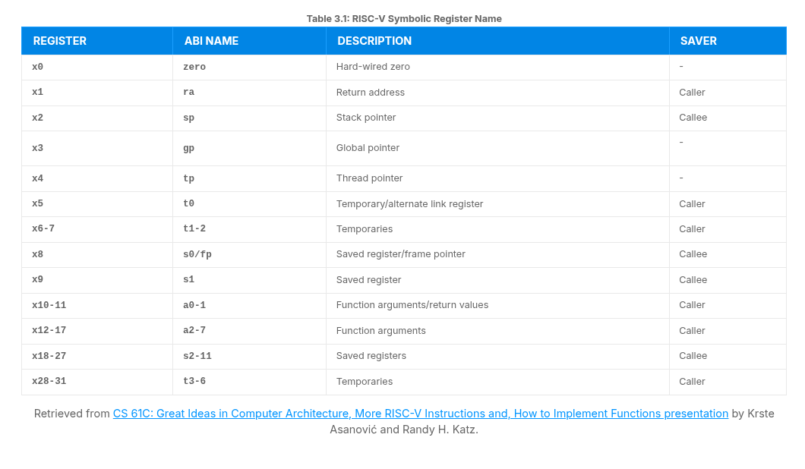
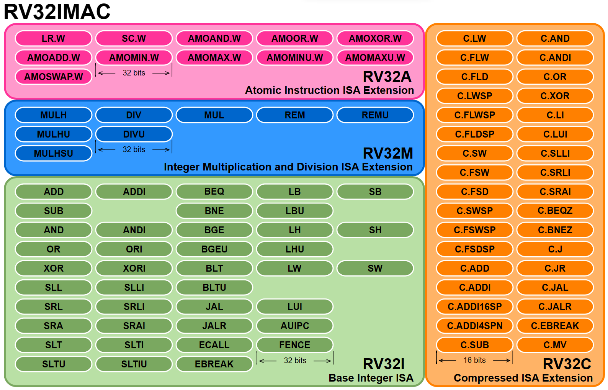

# Inside the Unprivileged Specification

> - https://trainingportal.linuxfoundation.org/learn/course/introduction-to-risc-v-lfd110/exploring-the-risc-v-instruction-set-architecture/unprivileged-specification?page=1
> - Details items that are not related to machine mode (M-Mode) or to Supervisor Mode (S-Mode).
> - The unprivileged specification includes the base integer (I) ISA as well as extensions to that base, like float (F), double (D), compressed instructions (C), and many more.
> - The base instruction sets describe the instruction format, basic integer instructions, load and store instructions, and other fundamental details of the ISA.

 

We break the base ISAs into several variants:
#

> - RV32I: Integer 32-bit.
> - RV32E: A version of RV32I with fewer registers for embedded applications.
> - RV64I: Integer 64-bit.
> - RV128I: Integer 128-bit.

 

...
#

> - All these BASE ISAs either reduce or extend of the RV32I base instruction set.
> - As an example, RV64I widens the integer registers and the supported user address space to 64 bits.
> - This means that the LOAD and STORE instructions work a bit differently than in RV32I and the unprivileged specification contains the chapter explaining these differences.

 
 
 

# RV32I Base Integer ISA

> - https://trainingportal.linuxfoundation.org/learn/course/introduction-to-risc-v-lfd110/exploring-the-risc-v-instruction-set-architecture/unprivileged-specification?page=2
> - With only 40 instructions, the RV32I base integer ISA implements the absolutely necessary operations to achieve basic functionality with 32-bit integers (its 64-bit variant is RV64I).

 

This ISA, encoded in 32-bits, includes instructions for:
#

> - Addition
> - Substraction
> - Bitwise Logical Operations
> - Load and Store
> - Jumps
> - Branches

 

...
#

> - The Base Integer ISA also specifies the 32 CPU registers, which are all 32-bits wide, plus the program counter.
> - THe only special register is x0, which always reads 0, as implemented in many previous RISC ISAs.
> - Although all registers are available for general purpose, the application binary interface (ABI) specifies a purpose for each of them, according to its calling convention.
> - This means that some registers are expected to hold temporary or saved data, pointers, return addresses, and so on.
> - The RV32I register file, showing the hardware register names and their assigned functionality as specified in the RISC-V application binary interface, is presented in the table below.

 

 
 
 

# Control and Status Registers (CSRs)

> - https://trainingportal.linuxfoundation.org/learn/course/introduction-to-risc-v-lfd110/exploring-the-risc-v-instruction-set-architecture/unprivileged-specification?page=3
> - CSR are a separate bank of registers with a separate 12-bit address space, limiting their number to 4096.
> - They usually contain various CPU information, like timers, counters, flags, manufacturer information and other data.

 

...
#

> - CSRs are special registers designed to control and monitor the processor's operation.
> - They serve as the mechanism through which software interacts with hardware to adjust settings, manage exceptions, and acquire information about the processor's status.
> - Understanding CSRs is essential for any RISC-V programmer, as they allow precise control over the processor's behavior and enable efficient system programming.

 

...
#

> - The Zicsr extension contains instructions intented for manipulation of CSRs, such as CSRRW (CSR read and write), CSRRS (CSR read and set), and CSRRC (CSR read and clear).
> - These instructions allow software to read and modify the values in the control and status registers.
> - The CSR instructions are covered 2.8 of the [Unprivileged Specification Document](https://drive.google.com/file/d/1s0lZxUZaa7eV_O0_WsZzaurFLLww7ou5/view).

 

| `Few of the most important CSR` | `Function` |
| ------------------------------- | ---------- |
| _mstatus_ (Machine Status Register) | This CSR is arguably the most critical one as it controls and monitors the machine's operating mode and privilege level.   It contains fields for controlling interrupt enable/disable status, setting the privilege level (M-mode, S-mode, U-mode), and various flags that that influence the processor's behavior.   It is fundamental for privilege level transitions and interrupt management. |
| _mepc_ (Machine Exception Program Counter) | Stores the program counter value of the instruction that caused an exception of interrupt in machine mode.   It determines where the program should resume execution after handling the exception. |
| _mtvec_ (Machine Trap-Vector Base Address) | Specifies the base address of the trap handler for machine mode, determining where the processor should jump to when an exception occurs. |
| _mcause_ (Machine Cause Register) | This CSR provides information about the reason for the most recent exception or interrupt.   It distinguishes between exceptions and interrupts and gives a code indicating the specific cause, such as a page fault or a software interrupt. |
| _misa_ (Machine ISA Register) | Specifies the supported instruction set extensions for the processor, allowing software to determine the capabilities of the RISC-V processor.   It also encodes the bit width of the base ISA (RV32, RV64, or RV128). |

 

...
#

> - The above CSRs are fundamental for the operation of a RISC-V processor, enabling privilege mode control, exception handling, and providing information about the processor's capabilities and recent events.
> - There are many more CSRs that serve important functions, these five are among the most critical for basic processor operation and software development.

 
 
 

# ISA Extensions

> - https://trainingportal.linuxfoundation.org/learn/course/introduction-to-risc-v-lfd110/exploring-the-risc-v-instruction-set-architecture/unprivileged-specification?page=4
> - The unprivileged specification also contains the descriptions of the extensions to these base ISA's.
> - Again, any extension that does not required M-mode to operate can be described in the unprivileged specification.
> - Once ratified, the below extensions are added to the unprivileged specification. Up ahead we will go through a few of the most popular RISC-V ISA extensions.

 

Each extension to the base ISA is developed and maintained by a task group:
#

> - _Crypto_: Task group working on cryptograpic extensions which can move many complex cryptographic algorithms into hardware, improving reliability and speed.
> - _B Extension_: Task group working on bit manipulation extensions which can speed up many common mathematical tasks.
> - _Vector (V) Extension_: Task group working on vector instructions which are at the heart of many graphical processing computations.

 
 
 

# The M Extension, for Multiplication

> - https://trainingportal.linuxfoundation.org/learn/course/introduction-to-risc-v-lfd110/exploring-the-risc-v-instruction-set-architecture/unprivileged-specification?page=5
> - The `RV32M` extension implements 8 instructions to perform multiplication and division on integers (`RV64M` adds 5 instructions to those 8).
> - Chapter 7 of the [unprivileged specification](https://riscv.org/specifications/ratified/) describes hhhow integer multiplication and division should be accomplished.

 

...
#

> - It describes how each of the multiplication instructions will behave, which registers are used for the multiplier and multiplicand, and where the result will be stored.
> - It does the same for division since functionality one can view division as simply the inverse of multiplication.

 

...
#

> - It may seem odd that this extension is not required.
> - However, for many embedded processors, multiplication can be done in software if it is not required very often or even at all.
> - Removing this logic from a processor saves money on development, keeping the end product cost lower.
> - It also reduces the area required inside the chip, and energy consumption in the final application.

 
 
 

# The F and D Extensions for "float" and "double"

> - https://trainingportal.linuxfoundation.org/learn/course/introduction-to-risc-v-lfd110/exploring-the-risc-v-instruction-set-architecture/unprivileged-specification?page=6

 

`F is for float`
#

> - The **F** extension adds support for single-precision floating-point arithmetic operations.
> - Single-precision floating-point numbers are typically represented using 32 bits, conforming to the IEEE 754 standard.
> - This extension introduces single-precision floating-point registers (**f0** to **f31**) and a set of single-precision floating-point instructions for operations suc as addition, subtraction, multiplication, division, and conversions between integer and single-precision floating-point values.
> - The F extension also includes for handling special values, like **NaN** (Not-a-Number) and infinites, and for comparing and rounding single-precision values.

 

`D is for double`
#

> - The D extension extends the floating-point capabilities of RISC-V to include double-precision floating-point arithmetic operations.
> - Double-precision numbers use 64-bits for representation and also follow the IEEE 754 standard for double-precision arithmetic.
> - With the D extension, double-precision floating-point registers **f0** to **f31** are now 64-bit wide, and it supports instructions for double-precision arithmetic operations, conversions between integer and double-precision values, and handling special values.
> - Double-precision arithmetic is particularly important for scientific and engineering applications that require higher precision than single-precision arithmetic can provide.
> - Many embedded applications do no require floating point logic, and hence these extensions are not part of the Base ISAs.

 
 
 

# The C Extension, for Compressed Instructions

> - https://trainingportal.linuxfoundation.org/learn/course/introduction-to-risc-v-lfd110/exploring-the-risc-v-instruction-set-architecture/unprivileged-specification?page=7
> - This extension provides an alternative 16-bit encoding for a special subset of existing instructions, reducing static and dynamic code size.

 

...
#

> - After analyzing countless lines of code generated by modern optimizing compilers, the creators of RISC-V identified the most popular instructions, and created 34 16-bit versions of those popular instructions, giving up some of the functionality of 32-bit versions (which are still available in the RV32I base ISA anyway).

 

...
#

> - Typically, 50%-60% of the RISC-V instructions in a program can be replaced with RVC instructions, resulting in a 25% - 30% code-size reduction.
> - The C extension is compatible with all other standard instruction extensions.
> - These 16-bit instructions may be freely intermixed with 32-bit instructions.
> - This means that any instruction can start on any 16-bit boundary.
> - As such, with the addition of the C extension to any system, no instructions can raise instruction-address-misaligned instructions.

 

This compression is possible because for these special instructions:
#

> 1. Some registers are more popular than others (as per the ABI).  
> 2. One operand is usually overwritten.  
> 3. There are some preferred immediate values.  

 

...
#

> - This allows encoding the instructions for a limited number of registers as operands, specifying only 2 registers instead of 3, using small immediate values, all of this in 16 bits.
> - By compressing the most frequently used instructions, you have a better chance of compressing your programs significantly.
> - In the following picture below, compare the green block (RV32I) with the orange block (RV32C).
> - Consider the RV32I instructions are 32 bits wide, while RV32C are 16 bits wide.

 

`Pseudoinstructions`
#

> - Are special instructions added to the assembly language to make programming less cumbersome.
> - It have a direct translation to machine code, and are supported by assemblers and compiler toolchains.
> - The C extension provides hardware support for specific versions of existing base ISA instructions.
> - Thus, one difference is that pseudoinstructions are a logical addition (software), whereas instructions from the c extension represent a logical and a physical addition (software and hardware).
