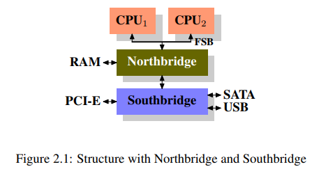

# Commodity Hardware Today

> - Scaling these days is most often achieved horizontally instead of vertically, meaning today it is more cost-effective to use many smaller, connected commodity computers instead of a few really large and exceptionally fast (and expensive) systems.

 

Over the years personal computers and smaller servers standardized on a chipset with the parts:
#

`(1) Northbridge`
#

> - All CPUs are connected via FSB (Front Side Bus) to the Northbridge.
> - Northbridge contains, among other things, the memory controller, and its implementation determines the type of RAM chips used for the computer.
> - Different types of RAM, such as DRAM, Rambus, and SDRAM, require different memory controllers.

 

`(2) Southbridge`
#

> - To reach all other system devices, the Northbridge must communicate with the Southbridge.
> - The Southbridge, often referred to as the I/O bridge, handles communication with devices through a variety of different buses.
> - Today the PCI, PCI Express, SATA, and USB buses are of most importance, but PATA, IEEE 1394, serial, and parallel ports are also supported by the Southbridge.
