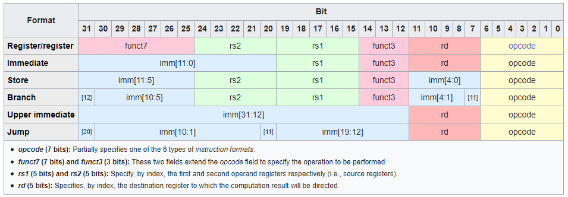
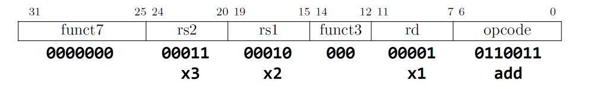

# Instruction Encoding

> - https://trainingportal.linuxfoundation.org/learn/course/introduction-to-risc-v-lfd110/exploring-the-risc-v-instruction-set-architecture/the-risc-v-instruction-set?page=1

 

The RV32I ISA specifies the following elements:
#

> - **1** 32-bit wide Program Counter Register.
> - **32** 32-bit wide Registers named x0 to x31.
> - **40** Unique 32-bit wide unprivileged instructions in six different formats (R, I, S, B, U, J) but with some recurring fields:
>   - A major opcode in the **7** least significant bits of the instruction, identifying the instruction.
>   - Source registers (rs1 always in bits **15 to 19**, rs2 in bits **20 to 24**).
>   - Destination register (rd in bits **7 to 11**) fields.
>   - Function fields, or minor opcodes, named **funct7** or **funct3** depending on their bit width. **Funct7** occupies the last **7** bits of the R type instruction and **func3** always occupies bits **12 to 14**.
>   - Immediate fields, which always tend to be towards the end (left side) of the instruction and are encoded differently depending on the instruction type.
> - **24** additional unique 32-bit wide privileged instructions in two formats (R and I).

 

> - A key principle of RISC-V that stands out in this table is the fixed instruction length.
> - All instructions are encoded in 32 bits. No exceptions.

 

`Instruction Encodings with Explanations`
#

_R-Type_  

> - Instructions are used for operations that involve two source registers and one destination register.
> - They typically include arithmetic and logic operations, such as addition, subtraction, bitwise operations, and comparisons.

 

_I-Type_  

> - Instructions are used for operations that involve an immediate value (a constant) and a source register.
> - Common _I-Type_ instructions include load operations as well as arithmetic operations with immediate values (e.g. **add1** for "add immediate").

 

_S-Type_  

> - Instructions are a subset of _I-Type_ instructions specifically used for storing data into memory.
> - They involve a source register, an immediate offset, and a base address register to specify the memory location where the data is to be stored.

 

_B-Type_  

> - Instructions are used for conditional branching operations.
> - They compare two registers and, based on the result, determine whether to take a branch instruction or not.
> - Common _B-Type_ instructions include **beq** (branch equal) and **bne** (branch if not equal).

 

_U-Type_  

> - Instructions are used for setting the upper bits of a register to a constant value, which is often used for initializing pointers or addresses.
> - The _U-Type_ instructions include **lui** (load upper immediate) and **auipc** (add upper immediate to PC).

 

_J-Type_  

> - Instructions are used for unconditional jump operations.
> - The jump instruction transfers control to a specified target address, like the **jal** (jump and link) instruction used for subroutine calls.

 
 
 

# Immediate and Address

> - https://trainingportal.linuxfoundation.org/learn/course/introduction-to-risc-v-lfd110/exploring-the-risc-v-instruction-set-architecture/the-risc-v-instruction-set?page=2
> - Other than **opcodes** and **registers**, any instruction encoding other than **R-Type** may contain immediates, that is a piece of data encoded directly in the instruction, rather than in memory or in a register.
> - This data can  represent either constants, to be used for example in arithmetic operations, or as memory addresses or offsets.

 

...
#

> - Different handling of immediates is the exact characteristic that defines the instruction types, but all of them tend to encode the immediates in similar positions in order to simplify the implementation of the hardware immeadiate decoder.
> - All immediates decode to **32-bit** wide values, but encoding varies by instruction.

 
 
 

# Instructions in Assembly Language

> - https://trainingportal.linuxfoundation.org/learn/course/introduction-to-risc-v-lfd110/exploring-the-risc-v-instruction-set-architecture/the-risc-v-instruction-set?page=3
> - Instruction mnemonics are used in RISC-V assembly language to represent specific instructions in a more human-readable from.
> - A mnemonic is a short string of letters that represents a specific instruction.

 

...
#

> - For example, in the instruction `add x1, x2, x3`, **add** is the mnemonic that represents the add instruction.
> - Functionality, that instruction means _"add the contents of x2 with contents of x3, and store the result in x1"_.

 

...
#

> - When an assembler encounters a mnemonic in the source code, it will use that mnemonic to translate the instruction into the corresponding machine code representation of the instruction, along with the encoding of the operands.

 

...
#

> - For example, the instruction `add x1, x2, x3` is translated by the assembler by the machine code instruction `0x003100B3`.
> - This long hexadecimal number can be extended to binary: `0000 0000 0011 0001 0000 0000 1011 0011`.
> - Which in turn can be represented as an **R-Type** instruction with the following fields:

 

As shown above, these are the meanings of the bit fields in the encoded instruction:
#

**funct7**: _0000000_  
**rs2**: _00011_: _x3_  
**rs1**: _00010_: _x2_  
**funct3**: _000_  
**rd**: _00001_: _x1_  
**opcode**: _0110011_: _add_  

> - Keep in mind that mnemonics are used both instructions and pseudoinstructions, which the assembler converts to machine instuctions.

 
 
 

# The RISC-V Instruction Set Reference Documents

> - https://trainingportal.linuxfoundation.org/learn/course/introduction-to-risc-v-lfd110/exploring-the-risc-v-instruction-set-architecture/the-risc-v-instruction-set?page=4
> - The instruction set is divided throughout the RISC-V base ISAs and extensions.
> - Therefore, it is a good idea to have [The RISC-V Instruction Set Manual Volume 1: Unprivileged ISA](https://drive.google.com/file/d/1uviu1nH-tScFfgrovvFCrj7Omv8tFtkp/view?usp=drive_link) handy in case you need to review some of the instructions in detail.
> - However, this document is very thorough and specifc, so a simpler alternative like a quick reference document may be more convenient.

[A RISC-V Reference Card](https://github.com/jameslzhu/riscv-card/releases/download/latest/riscv-card.pdf)  
> - Help to get familiar with the instructions RV32I and many extensions.

[The RISC-V Reference Card](http://riscvbook.com/greencard-20181213.pdf)  
> - Included in the previously mentioned book titled [The RISC-V Reader](https://drive.google.com/file/d/1uviu1nH-tScFfgrovvFCrj7Omv8tFtkp/view?pli=1), by David Patterson and Andrew Waterman.

 
 
 

# Exercise: Using RISC-V Reference Card

> - https://trainingportal.linuxfoundation.org/learn/course/introduction-to-risc-v-lfd110/exploring-the-risc-v-instruction-set-architecture/the-risc-v-instruction-set?page=5

 

Here are the answers to the questions on the previous page:
#

> 1. Which bitwise logical operations are available?
> - AND
> - OR
> - XOR

 

> 2. Which conditional branches are available?
> - Branch if equal
> - Branch if not equal
> - Branch if else than (signed and unsigned)
> - Branch if greater or equal (signed and unsigned)

 

> 3. Which instructions use immediate values?
> - All except register operations and environment calls.

 

> 4. Are there any traditional instructions missing? Yes.
> - Bitwise not
> - Branch if less or equal
> - Branch if greater than
> - Load immeadiate
> - No operation (nop)
> - Unconditional jump
> - Subroutine call
> - Subtract immediate
> - Register Move/Copy

 
 
 

# A Few Peculiar RISC-V Design Decisions

> - https://trainingportal.linuxfoundation.org/learn/course/introduction-to-risc-v-lfd110/exploring-the-risc-v-instruction-set-architecture/the-risc-v-instruction-set?page=7

 

`Design Decisions`
#

_There is no Flag/Condition-Code Register:_
> - RISC-V does not have dedicated condition code registers, as seen in many other architectures.
> - Instead, it relies on branch instructions to evalue conditions directly using the contents of general-purpose registers.

_Register x0 is Hardwired to 0:_
> - In RISC-V, register x0 is hardwired contain the value 0 and cannot be written to.
> - This design choice simplifies the hardware and eliminates the need to allocate a separate opcode for instructions that perform operations with the constant 0.

_There is no way to specify a 32-bit Immediate in a single instruction:_
> - Instead, RISC-V uses a sequence of 2 instructions to specify a full 32-bit immediate value.
> - For example, **lui** is used to set the upper bits of a register, and **addi** can be used to set the lower bits, like this: `lui x1, 0x12345` sets the upper bits of **x1**, and then `addi, x1, x1, 0x678` sets the lower bits, resulting in the 32-bit immediate value **0x12345678** in **x1**.
>   - This approach simplifies instruction decoding and execution, as opposed to having a single instruction for 32-bit immediates.
>   - Another reason for this is that all instructions are encoded in the same length, so having to fetch a second word with an immediate would not be very RISC-like.

_There are no dedicated multiply or divide instructions in the base RISC-V ISA:_
> - Instead, multiplication and division are implemented using regular arithmetic and logical instructions, potentially impacting performance.
> - However, this decision favors low end embedded microcontrollers, which may not even need multiplication or division.
> - After all, for processors intended to run applications that might require multiplication or division, the RVM extension can always be included.

_There are lots of basic instructions missing:_
> - These include unconditional jump and branch, no operation, register move, two's complement, and bitwise not.
> - It turns out that these operations are considered redundant, as they are special cases of existing instructions in the ISA.
> - Remember: One of the key principles of RISC is a small instruction set.
> - The fact that some instructions are missing does not mean that the operations they would implement are also missing.
> - Since these operations can be performed by existing instructions, there is a set of pseudoinstructions defined in the ISA (and thus supported by RISC-V assemblers), which implement these missing operations.
> - Here are few examples:
>   - A conditional jump can be performed with a jump-and-link instruction which saves the return address to register **x0**. Remember that writing to this register has no effect, so the jump-and-link instruction ends up performing an unconditional jump.
>   - Instead of dedicated "nop" instruction, you can use a simple `addi x0, x0, 0` to perform a no-operation. This instruction adds the contents of **x0** (which is 0) to the immediate value 0, and stores this results in register **x0**, which cannot be written to. This effectively accomplishes nothing, just what we expect from a **nop**.
>   - Bitwise **NOT** can be achieved using an **XOR** instruction with an all-ones immediate value.
>   - Instead of a "move register" instruction; moving data can be done by adding contents of the source register with the immediate value 0, and storing the result in the destination register.
>   - To calculate a register's two's complement, you can simply subtract the register's contents from zero.
> - All these operations have their pseudoinstructions available in assembly language as if they were actual instructions, because in a way, they are.

_There is no Stack Pointer_
> - RISC-V itself does not specify a predefined stack pointer register.
> - While most architectures like **x86**, **MIPS**, and **ARM** include a dedicated stack pointer register, the choice of which register to use as the stack pointer in RISC-V is determined by the ABI (Application Binary Interface).
> - This flexibility allows different ABIs to select different registers for the stack pointer, which can be advantageous in various implementation scenarios.
> - Technically, any register other then **x0** can be used as a stack pointer.

_There are no push nor pop instructions:_
> - RISC-V does not include dedicated push and pop instructions commonly found in most architectures for managing a stack.
> - Stack operations are typically achieved using a combination of load and store instructions, in conjunction with additions, subtractions, and the stack pointer (as defined by the ABI).
