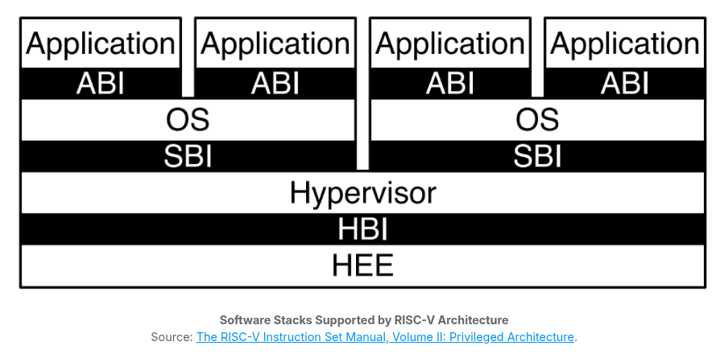

# Introduction to the Privileged Specification

> - https://trainingportal.linuxfoundation.org/learn/course/introduction-to-risc-v-lfd110/exploring-the-risc-v-instruction-set-architecture/the-privileged-specification?page=1
> - The unprivileged instruction set architecture presented so far is not enough to run modern execution environments.
> - As its name suggests, the privileged specification contains descriptions of the RISC-V ISA which operate in Machine Mode (M-mode) or Supervisor Mode (S-mode).
> - These modes have elevated privileges and are therefore described in a completely separate document from the base ISA and standard extensions.
> - This specification also contains additional functionality required for running rich operating systems like Linux.
> - In fact, the RISC-V privileged specification was designed to support virtualized systems implementing the typical software stack shown below:

> - The diagram shows a virtual machine monitor configuration where multiple multiprogrammed operating systems are supported by a single hypervisor.
> - Each OS communicates via a _Supervisor Binary Interface_ (SBI) with the hypervisor, which provides the _Supervisor Execution Environment_ (SEE).
> - The hypervisor communicates with the _Hypervisor Execution Environment_ (HEE) using a _Hypervisor Binary Interface_ (HBI), to isolate the hypervisor from details of the hardware problem.

 
 
 

# Machine-Level (M-Mode) ISA, Version 1.12

> - https://trainingportal.linuxfoundation.org/learn/course/introduction-to-risc-v-lfd110/exploring-the-risc-v-instruction-set-architecture/the-privileged-specification?page=2

...
#

> - This chapter describes the machine-level features available in machine-mode (M-mode).
> - M-mode is used for low-level access to a hardware platform and is the first mode entered at reset, when the processor finishes initializing and is ready to execute code.
> - M-mode can also be used to implement features that are too difficult or expensive to implement in hardware directly.
> - A good example of this would be a watchdog timer implemented in low level software (firmware) which helps the system recover from faults.

 

Important Features of M-mode:
#

`Non-maskable Interrupts`
> - Non-maskable interrupts (NMIs) are only used for hardware error conditions.
> - When fired, they cause an immediate jump to an NMI handler running in M-mode, regardless of how that hardware thread has its interrupt enable bit set.
> - In other words, that interrupt will be serviced without a way to block the service in configuration.
> - Each NMI will have a **mcause** register associated with it.
> - This allows implementations to decide hhow they wish to handle these interrupts and allows them to define many possible causes.
> - NMIs do not reset processor state which enables diagnosis, reporting, and possible containment of the hardware error.

`Physical Memory Attributes (PMA)`
> - The physical memory map for a system includes address ranges like memory regions, memory-mapped control registers, and empty holes in the address space.
> - Some memory regions might not support reads, write, or execution; some might not support subword or subblock accesses; some might not support atomic operations; and some might not support cache coherence or might have different memory models.
> - In RISC-V systems, these properties and capabilities of each region of the machine's physical address space are termed physical memory attributes (PMAs).
> - The PMAs of some memory regions are fixed at chip design time - for example, for an on-chip ROM.
> - Others are fixed at board design time, depending, for example, on which other chips are connected to off-chip buses.
> - Some devices might be configurable at run time to support different uses that imply different PMAs - for example, an on-chip scratchpad RAM might be cached privately by one core in one end-application, or accessed as a shared non-cached memory in another end-application.
> - Most systems will require that at least some PMAs are dynamically checked in hardware later in the execution pipeline after the physical address is known, as some operations will not be supported at all physical memory addresses, and some operations require knowing the current setting of a configurable PMA attribute.
