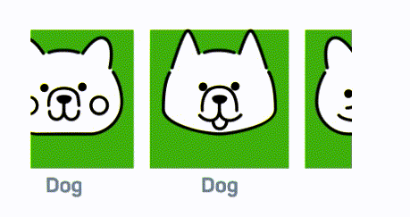
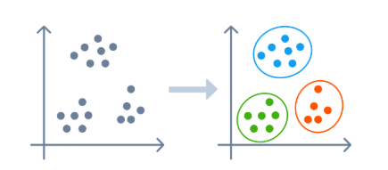
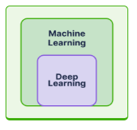

# Machine Learning Models

> - https://www.sololearn.com/en/learn/courses/llms-ai/lesson/5131475778?p=1
> - Machine learning has revolutionized the way businesses operate and make decisions.
> - For today's leading companies like Facebook, Google, and Uber, ML is key.

 

`Model`
#

> - A computer program that can make predictions or decisions.
> - Machine learning models lears from data.
> - An LLM is a model that has learned from a diverse and vast amount of text data, called `Corpus`.

 

`Training`
#

> - The process of making a model learn from data so it can make better predictions and decisions.
> - Different models are trained for different tasks.
> - For a model to be ready to use, it first needs to be trained.

 

Machine learning uses two approaches:
#

(1) **Supervised Learning**  
(2) **Unsupervised Learning**

 

`Supervised Learning`
#

> - Frequently used to make predictions or decisions.
> - Supervised learning takes in labeled data.
> - Example a machine learning model that has been trained with loads of examples of fraudulent and legitimate card transactions to predict fraud.
> - Requires human involvement to label the training data.

 

`Unsupervised Learning`
#

> - It tries to discover patterns and relationships within unlabeled data.
> - A business using unlabelled data to train a machine learning model to group their customers based on age, income and buying behavior.

 

`Deep Learning`
#

> - Inspired the way the human brain processes information, a network of artificial neurons is able to learn from data.
> - Deep learning is a type of machine learning model with multiple layers of neural network.
> - Deep learning models require very large amounts of training data and are very effective at tasks such as image recognition, natural language processing and make more accurate predictions.

