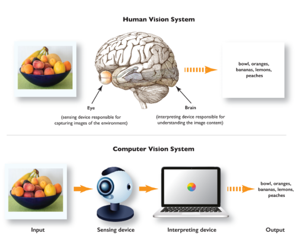

## $\textnormal{What is Computer Vision}$

> - `Computer Vision` is a subfield of Deep Learning and AI where  
    humans teach computers to see and interpret the world around  
    them.

 

| Human Vision System vs. Computer Vision System |
| ---------------------------------------------- |
|  |

 
