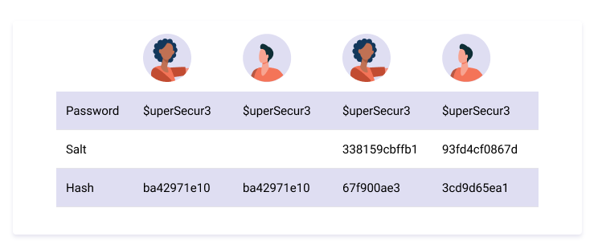

## $\textnormal{How Do You Mitigate an Insecure Hash}$

> - Use a strong hash function but we also need to implement <br />
    strong password policies.

> - On top of that, we can salt a hash to make it even more secure.

<br />
<br />


## $\textnormal{Salting}$

> - A `salt` is a random string that gets attached to a <br />
    plaintext password before it gets hashed.

> - As we saw above, a hash cannot be reversed but it can <br />
    be compared with existing generated hash output.

> - By adding a salt to the password, the hash output is no <br />
    longer predictable.

> - This is because it is increasing the uniqueness of the <br />
    password, thus, the uniqueness of tha hash itself.

| Salt Example |
| ------------ |
|  |

<br />

| What is Randomness? |
| ------------------- |
|  |

<br />

> - Using bcrypt.

```go
import (
    "golang.org/x/crypto/bcrypt"
    "fmt"
)

var password = r.Form.Get("password")
var passwordBytes = []byte(password)

hashedPasswordBytes, _ := bcrypt.
GenerateFromPassword(passwordBytes, bcrypt.MinCost)
```

<br />
<br />


## $\textnormal{Keep Learning}$

> - Best practices of storing password.

```plaintext
https://snyk.io/learn/password-storage-best-practices/
```

> - Tips on how to deal with passwords.

```plaintext
https://medium.com/@secureica/how-not-to-store-password-developer-perspective-3d6f5799f3f8
```

> - NIST guidelines for US federal use of hash functions.

```plaintext
https://csrc.nist.gov/projects/Hash-Functions
```

> - Node.js bcrypt library.

```plaintext
https://www.npmjs.com/package/bcrypt
```
