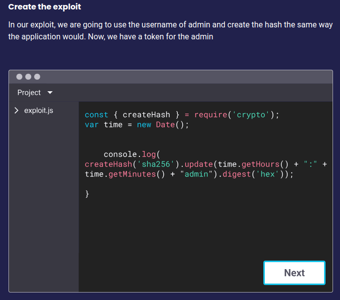

## $\textnormal{Insecure Randomness in Action}$

```plaintext
https://learn.snyk.io/lesson/insecure-randomness/
```

> - Below is an example of insecure randomness attack.

<br />

| Step 1 |
| ------ |
| Setting the Stage |

<br />

| Step 2 |
| ------ |
|   |

<br />

| Step 3 |
| ------ |
|  |

<br />

| Step 4 |
| ------ |
|  |

<br />

| Step 5 |
| ------ |
|  |

<br />

| Step 6 |
| ------ |
|  |
