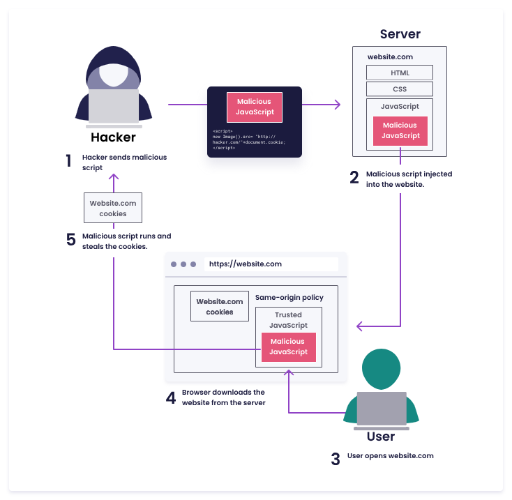

## $\textnormal{Same-Origin Policy}$

> - Each time you visit a website, your browser downloads <br />
    HTML, CSS, and JavaScript from the server that hosts <br />
    the website.

> - The browser interprets and displays HTML and CSS and <br />
    executes JavaScript.

> - However, by design, when a piece of JavaScript is <br />
    downloaded from a website, it can only access secrets <br />
    (e.g. cookies) associated with that website.

> - For instance, JavaScript code downloaded from startup.io <br />
    cannot access cookies set by yourbank.com.

> - This isolation is called the “same-origin policy“, and <br />
    it is enforced by the browser.

> - `XSS` is a vulnerability that breaks the same-origin policy.

| XSS Attack Illustration |
| ----------------------- |
|  |

<br />

```go
// Once a user send a message, this function is invoke.
func handleMessageSend(messageId, senderEmail, messageContent string) {
    database.save(messageId, senderEmail, messageContent)
}

// Return the message.
func generateMessageHTML(messageId string) string {
    messageContent := database.loadContent(messageId)
    return fmt.Fprintf(out, "<p class=\"messageContent\">%s</p>", messageContent)
}
```

<br />

```plaintext
Stored XSS
    - It is called “stored” because the malicious JavaScript
      is persisted on the website's backend.

Reflected XSS
    - Similar to stored, except that the malicious JavaScript
      does not get persisted by the application server.
    - Instead, it gets “reflected” to the user immediately.
    - One typical example is a dynamic generation of an error
      page with the user input injected into the error message.

DOM-based XSS
    - The malicious script is injected into HTML on the client
      side by JavaScript’s DOM manipulation.
```

<br />
<br />


## $\textnormal{What is the Impact XSS?}$

```plaintext
- Stealing sensitive information, including session tokens,
  cookies or user credentials.

- Injecting multiple types of malware (e.g. worms) into the
  website.

- Changing the website appearance to trick users into performing
  undesirable actions.
```

> - Most common web vulnerability.

```plaintext
https://snyk.io/series/open-source-security/?loc=learn
```
