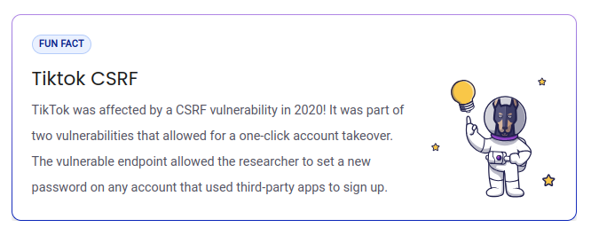

## $\textnormal{What is CSRF}$

```plaintext
https://learn.snyk.io/lesson/csrf-attack/
```

> - `Cross site request forgery (CSRF)` is a vulnerability <br />
    where an attacker performs actions while impersonating <br />
    another user.

> - Some form of social engineering, like phishing or <br />
    spoofing, is usually required for this kind of attack <br />
    to be successful.

> - The attacker typically needs to trick the user into <br />
    visiting a malicious website for the attack to take place.

> - This malicious website would then contain a request to <br />
    the targeted website.

> - If the user is authenticated by the targeted website, <br />
    the request is executed.

> - This attack works because the user's cookies are <br />
    automatically included in the modified request to a <br />
    legitimate application.

> - CSRF vulnerabilities occur when vulnerable web apps <br />
    simply trust the cookies sent by web browsers without <br />
    further validation.

| Tiktok CSRF |
| ----------- |
|  |
