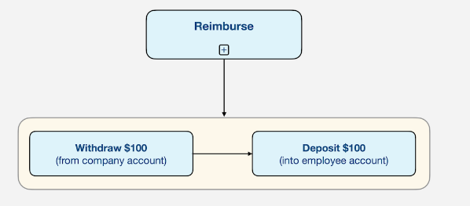

### EXPENSE REPORT
#
> - Like the other workflows, filing an expense report involves a sequence of steps.

> - First, you create the report, describe the items you purchased, attach receipts
    if necessary, and then you submit it.

> - The manager then reviews it, either rejecting it (in which case you'll be
    notified so you can fix the problem and resubmit if necessary) or approving it.

> - If approved, the accounting department will process it, reimburse you by sending
    a check or direct deposit, and then let you know they've done so.

> - They will also archive this report so it's available in case of an audit.


<br />
<br />


### MONEY TRANSFER
#
> - Another interesting to observe about a workflow is that it can composed of other
    workflows.

> - In the case of the expense report scenario, you might think of the reimbursement
    as a single step, but it's actually two distinct operations.



<br />
<br />


### QUIZ
#

```plaintext
Which of the following is a Temporaal Workflow allowed to contain?
- Business logic that may take days, weeks, or longer to complete.
- Conditional statements.
- Cycles (steps that refer to previous steps).
```
