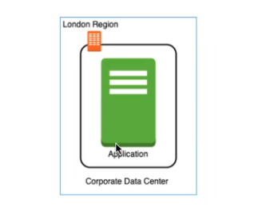
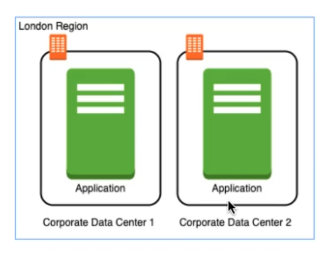

## Regions and Zones

<br />

| Example 1 |
| ------------------- |
|  |

<br />

```plaintext
Example 1:
    Challenges:
        - Slow access for users from other parts of the world (high latency).
        - If the data center crashes, your application goes down (low availability).
```

<br />

| Example 2 |
| --------- |
|  |

<br />

```plaintext
Example 2:
    Challenges:
        - Slow access for users from other parts of the world.
        - If entire London region is unavailable, your application goes down.

    Solved
        - If one data center crashes, your application still available.
```

<br />

| Example 3 |
| --------- |
|  |

<br />

```plaintext
Example 3:
    Challenges:
        - (Partly solved) Still slow access for users from other parts
          of the world. Can be solved by adding deployments for other regions.

    Solved:
        - What if one data center crashes?
        - What if entire region of London is not available?
```
