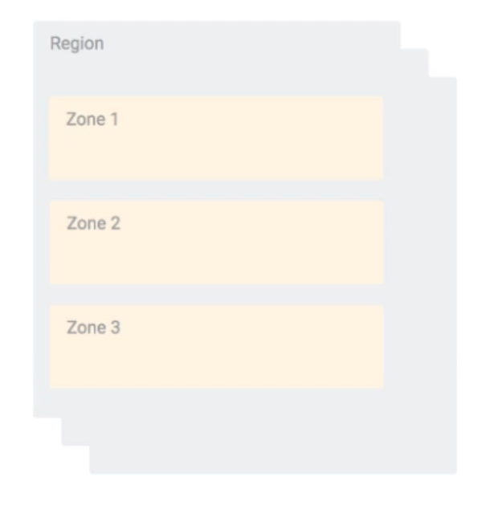
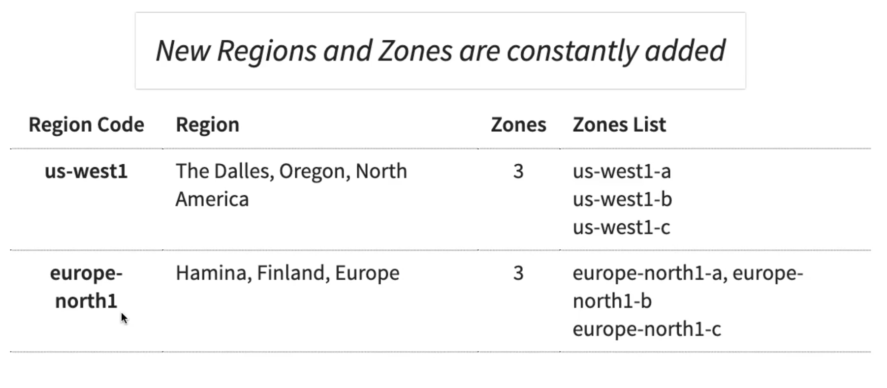

## Regions

> - A `region` is a specific geographical location most to host <br />
    your resources.

```plaintext
Advantages
    - High availability.
    - Low latency.
    - Global footprint.
    - Adhere to government regulations.
```

<br />
<br />


## Zones

<br />

| Zones Example 1 |
| -------------- |
|  |

<br />

```plaintext
- How to achieve high availability in the same region (or
  geographic location)?.
    - Enter zones.

- Each region has three or more zones.

- (Advantage) Increased availability and fault tolerance
  within same region.

- Each zone has one or more discrete clusters.
    Cluster
        - Distinct physical infrastructure that is housed
          in a data center.

- Zones n a region are connected through low-latency links.
```

<br />
<br />


## Regions and Zones Examples

| Zones Example 2 |
| --------------- |
|  |
