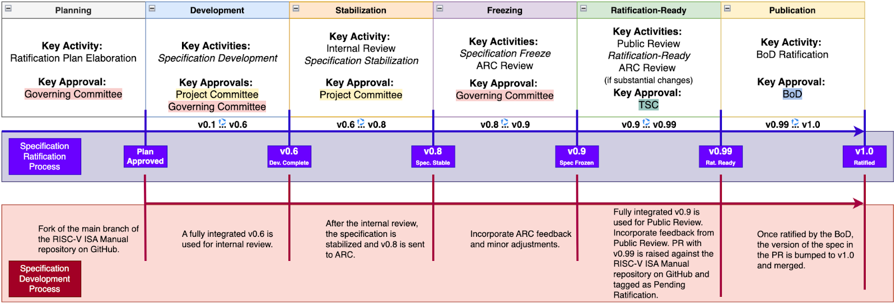

# RISC-V ISA Specification Documents

> - https://trainingportal.linuxfoundation.org/learn/course/introduction-to-risc-v-lfd110/exploring-the-risc-v-instruction-set-architecture/risc-v-specification?page=1

 

`RISC-V ISA`
#

> - It was defined while avoiding implementation details as much as possibble.
> - It should be read as the software-visible interface to a wide variety of implementation rather than as the design of a particular hardware artifact.

 

`RISC-V Instruction Set Manual Volume 1`
#

> - https://drive.google.com/file/d/1uviu1nH-tScFfgrovvFCrj7Omv8tFtkp/view
> - Covers the design of the base unprivileged instructions, including optional unprivileged ISA extensions.
> - Unprivileged instructions are those that are generally usable in all privilege modes in all privileged architectures, though behavior might vary depending on privilege mode and privilege architecture.

 

`RISC-V Instruction Set Manual Volume II`
#

> - https://drive.google.com/file/d/17GeetSnT5wW3xNuAHI95-SI1gPGd5sJ_/view
> - Provides the design of the first privileged architecture.

 
 
 

# RISC-V: A Modular ISA

> - https://trainingportal.linuxfoundation.org/learn/course/introduction-to-risc-v-lfd110/exploring-the-risc-v-instruction-set-architecture/risc-v-specification?page=2

 

`RISC-V`
#

> - A seasoned architecture designed to succeed where others have failed in the past.
> - Designed as a modular ISA, as opposed to the traditional incremental ISAs in commercial processors like the ARM Cortex family.
> - Modularity means that a RISC-V implementation is composed of a mandatory base ISA and a number of ISA extensions so that custom CPUs may be tailored to the needs of the application.
> - Any extension can be used or left out for a specific implementation.

 

`Other ISA`
#

> - Conversely, an incremental architecture requires an ISA to contain all the ISAs contained in the ISA it extends.
> - For example, the ARM Cortex-M4 instruction set contains all the instructions in the Cortex-M3 instruction set, and in turn, all those in Cortex-M0+ instruction set.
> - There is no way an ARM Cortex-M4 processor would only contain instructions from the M4 and M0+ instruction sets, skipping the instructions of the M3 instruction set in the middle.

 

`RV32IMAC ISA`
#

> - A popular RISC-V core for a number of embedded microcontrollers available today implements the RV32IMAC ISA.
> - The naming convention for custom RISC-V ISAs consists of the letters RV (for RISC-V) followed by the bit-width, and then a series of 1-letter identifiers for the base ISA and its extensions.
> - `RV32I`: A 32-bit CPU with the Base Integer ISA, this includes the absolutely necessary instructions for basic operation.
> - `M`: The Integer Multiplication and Division extension.
> - `A`: The Atomic Instruction extension.
> - `C`: The Compressed Instruction extension, this provides an alternative 16-bit encoding for a special subset of existing RV321 instructions, which are encoded in 32 bits.

 

Graphical representation of the unprivileged RV32IMAC instruction set:
#

 

`RV32IMAFD`
#

> - Another popular ISA, often abbreviated as RV32G.
> - The letter G does not represent an ISA extension, but it stands for General.

 

`Books`
#

> - [The RISC-V Reader](http://riscvbook.com/)

 
 
 

# RISC-V Instruction Set Architecture Primer

> - https://trainingportal.linuxfoundation.org/learn/course/introduction-to-risc-v-lfd110/exploring-the-risc-v-instruction-set-architecture/risc-v-specification?page=3

 

Defining an Instruction Set Architecture (ISA):
#

> - An instruction set architecture (ISA) is an abstract model of a computer.
> - It is also referred to as architecture or computer architecture.
> - A realization of an ISA, such as CPU, is called an implementation.
> - Some ISAs you may have heard of include x86, ARM, MIPS, PowerPC, or SPARC.
> - All of this ISAs require a license to implement them.
> - On the other hand, the RISC-V ISA is provided under open source licenses that do not require fees to use.

 

How the RISC-V ISA is different:
#

> - The most notable difference between RISC-V and other ISAs is that RISC-V is developed by a member organization that is completely free to join and licenses its ISA with permissive open source licenses.
> - This means that anyone can contribute to the specifications, and no one company or group of companies can drive the direction of the standards.
> - The Technical Steering Committee (TSC) provides leadership to our technical initiatives and approves technical deliverables for ratification or release.

 

Collaborative development model:
#

> - A RISC-V specification starts its life as a Task Group approved by the Technical Steering Committee (TSC).
> - Once a Task Group has an approved charter, they begin work publicly on GitHub by writing their documents in AsciiDoc format.
> - These repositories on Github can only receive pull requests from RISC-V international members. however the work is done publicly and transparently.
> - For groups who choose to take minutes, those minutes from the Task Group meetings are published publicly as well.
> - The public is free to submit issues to the Github repository in order to give early feedback on any specification.
> - Non-ISA specifications and standards (e.g., processor trace, architectural tests, software overlay) are developed in a simialr fashion.
> - RISC-V Specifications live on Github and are housed alongside dozens of software projects.

 
 
 

# RISC-V Extensions Lifecycle

> - https://trainingportal.linuxfoundation.org/learn/course/introduction-to-risc-v-lfd110/exploring-the-risc-v-instruction-set-architecture/risc-v-specification?page=4
> - Every module specification of RISC-V goes through a design process, where the maturity of the design is indicated by its status, which may be Open, Frozen, or Ratified.
> - RISC-V International specifies a procedure to propose an ISA extension that anyone, in principle, can follow.

 

The main steps are summarized as follows:
#

(1). An extension being developed by its proponent and/or the community at large is referred to as in "Open" status.
(2). When all the main features of the extension have been developed to the point that no substantial modifications are deemed possible, except for very minimal updates, the extension is referred to as in "Frozen" status.
(3)>

 
 
 

# RISC-V Extensions Lifecycle

> - https://trainingportal.linuxfoundation.org/learn/course/introduction-to-risc-v-lfd110/exploring-the-risc-v-instruction-set-architecture/risc-v-specification?page=4
> - Every module specification of RISC-V goes through a design process, where the maturity of the design is indicated by its status, which may be Open, Frozen, or Ratified.
> - RISC-V International specifies a procedure to propose an ISA extension that anyone, in principle, can follow.

 

The main steps are summarized as follows:
#

> (1). An extension being developed by its proponent and/or the community at large is referred to as in "Open" status.  
> (2). When all the main features of the extension have been developed to the point that no substantial modifications are deemed possible, except for very minimal updates, the extension is referred to as in "Frozen" status.  
> (3). A frozen extension is subject to a period of public review for further refinement and to a final ratification-by-vote, after which the extension is referred to as in "Ratified" status.

 

RISC-V development process:
#

> - https://riscv.atlassian.net/wiki/spaces/TAXX/pages/174522378/RISC-V+Development+Process

 

RISC-V development process milestone:
#

> (1) _The Plan Milestone_ describes the proposed work and schedules.  
> (2) _The Development Milestone_ creates the early versions of the specification and declares them reasonably stable.  
> (3) _The Stable Milestone_ continues specification development until it is self-consistent and stable.  
> (4) _The Freeze Milestone_ brings the document to feature complete, declares that no substantive changes are planned, and prepares the document for Public Review.  
> (5) _The Publication Milestone_ provides the final approval from the Board and publishes the specification externally.

 

For full details on this process, refer to the following documents:
#

> (1) The [RISC-V Development Process](https://riscv.atlassian.net/wiki/spaces/TAXX/pages/174522378/RISC-V+Development+Process) page details the full procedure to ratify an extension.  
> (2) The [Fast Tract Architecture Extension Process](https://riscv.atlassian.net/wiki/spaces/TAXX/pages/174522378/RISC-V+Development+Process#Fast-Track-or-Technical-Committee%3F) presents a reduced faster version of the procedure for small extensions.  
