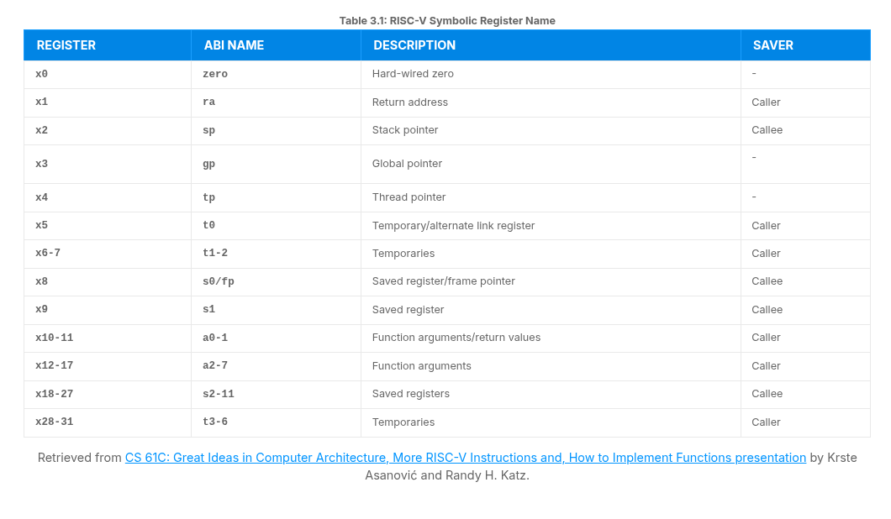

# Inside the Unprivileged Specification

> - https://trainingportal.linuxfoundation.org/learn/course/introduction-to-risc-v-lfd110/exploring-the-risc-v-instruction-set-architecture/unprivileged-specification?page=1
> - Details items that are not related to machine mode (M-Mode) or to Supervisor Mode (S-Mode).
> - The unprivileged specification includes the base integer (I) ISA as well as extensions to that base, like float (F), double (D), compressed instructions (C), and many more.
> - The base instruction sets describe the instruction format, basic integer instructions, load and store instructions, and other fundamental details of the ISA.

 

We break the base ISAs into several variants:
#

> - RV32I: Integer 32-bit.
> - RV32E: A version of RV32I with fewer registers for embedded applications.
> - RV64I: Integer 64-bit.
> - RV128I: Integer 128-bit.

 

...
#

> - All these BASE ISAs either reduce or extend of the RV32I base instruction set.
> - As an example, RV64I widens the integer registers and the supported user address space to 64 bits.
> - This means that the LOAD and STORE instructions work a bit differently than in RV32I and the unprivileged specification contains the chapter explaining these differences.

 
 
 

# RV32I Base Integer ISA

> - https://trainingportal.linuxfoundation.org/learn/course/introduction-to-risc-v-lfd110/exploring-the-risc-v-instruction-set-architecture/unprivileged-specification?page=2
> - With only 40 instructions, the RV32I base integer ISA implements the absolutely necessary operations to achieve basic functionality with 32-bit integers (its 64-bit variant is RV64I).

 

This ISA, encoded in 32-bits, includes instructions for:
#

> - Addition
> - Substraction
> - Bitwise Logical Operations
> - Load and Store
> - Jumps
> - Branches

 

...
#

> - The Base Integer ISA also specifies the 32 CPU registers, which are all 32-bits wide, plus the program counter.
> - THe only special register is x0, which always reads 0, as implemented in many previous RISC ISAs.
> - Although all registers are available for general purpose, the application binary interface (ABI) specifies a purpose for each of them, according to its calling convention.
> - This means that some registers are expected to hold temporary or saved data, pointers, return addresses, and so on.
> - The RV32I register file, showing the hardware register names and their assigned functionality as specified in the RISC-V application binary interface, is presented in the table below.

 

 
 
 

# Control and Status Registers (CSRs)

> - https://trainingportal.linuxfoundation.org/learn/course/introduction-to-risc-v-lfd110/exploring-the-risc-v-instruction-set-architecture/unprivileged-specification?page=3
> - CSR are a separate bank of registers with a separate 12-bit address space, limiting their number to 4096.
> - They usually contain various CPU information, like timers, counters, flags, manufacturer information and other data.

 

...
#

> - CSRs are special registers designed to control and monitor the processor's operation.
> - They serve as the mechanism through which software interacts with hardware to adjust settings, manage exceptions, and acquire information about the processor's status.
> - Understanding CSRs is essential for any RISC-V programmer, as they allow precise control over the processor's behavior and enable efficient system programming.

 

...
#

> - The Zicsr extension contains instructions intented for manipulation of CSRs, such as CSRRW (CSR read and write), CSRRS (CSR read and set), and CSRRC (CSR read and clear).
> - These instructions allow software to read and modify the values in the control and status registers.
> - The CSR instructions are covered 2.8 of the [Unprivileged Specification Document](https://drive.google.com/file/d/1s0lZxUZaa7eV_O0_WsZzaurFLLww7ou5/view).

 

| `Few of the most important CSR` | `Function` |
| ------------------------------- | ---------- |
| _mstatus_ (Machine Status Register) | This CSR is arguably the most critical one as it controls and monitors the machine's operating mode and privilege level.   It contains fields for controlling interrupt enable/disable status, setting the privilege level (M-mode, S-mode, U-mode), and various flags that that influence the processor's behavior.   It is fundamental for privilege level transitions and interrupt management. |
| _mepc_ (Machine Exception Program Counter) | Stores the program counter value of the instruction that caused an exception of interrupt in machine mode.   It determines where the program should resume execution after handling the exception. |
| _mtvec_ (Machine Trap-Vector Base Address) | Specifies the base address of the trap handler for machine mode, determining where the processor should jump to when an exception occurs. |
| _mcause_ (Machine Cause Register) | This CSR provides information about the reason for the most recent exception or interrupt.   It distinguishes between exceptions and interrupts and gives a code indicating the specific cause, such as a page fault or a software interrupt. |
| _misa_ (Machine ISA Register) | Specifies the supported instruction set extensions for the processor, allowing software to determine the capabilities of the RISC-V processor.   It also encodes the bit width of the base ISA (RV32, RV64, or RV128). |

 

...
#

> - The above CSRs are fundamental for the operation of a RISC-V processor, enabling privilege mode control, exception handling, and providing information about the processor's capabilities and recent events.
> - There are many more CSRs that serve important functions, these five are among the most critical for basic processor operation and software development.

 
 
 

# ISA Extensions

> - https://trainingportal.linuxfoundation.org/learn/course/introduction-to-risc-v-lfd110/exploring-the-risc-v-instruction-set-architecture/unprivileged-specification?page=4
> - The unprivileged specification also contains the descriptions of the extensions to these base ISA's.
> - Again, any extension that does not required M-mode to operate can be described in the unprivileged specification.
> - Once ratified, the below extensions are added to the unprivileged specification. Up ahead we will go through a few of the most popular RISC-V ISA extensions.

 

Each extension to the base ISA is developed and maintained by a task group:
#

> - _Crypto_: Task group working on cryptograpic extensions which can move many complex cryptographic algorithms into hardware, improving reliability and speed.
> - _B Extension_: Task group working on bit manipulation extensions which can speed up many common mathematical tasks.
> - _Vector (V) Extension_: Task group working on vector instructions which are at the heart of many graphical processing computations.

 
 
 

# The M Extension, for Multiplication

> - https://trainingportal.linuxfoundation.org/learn/course/introduction-to-risc-v-lfd110/exploring-the-risc-v-instruction-set-architecture/unprivileged-specification?page=5
