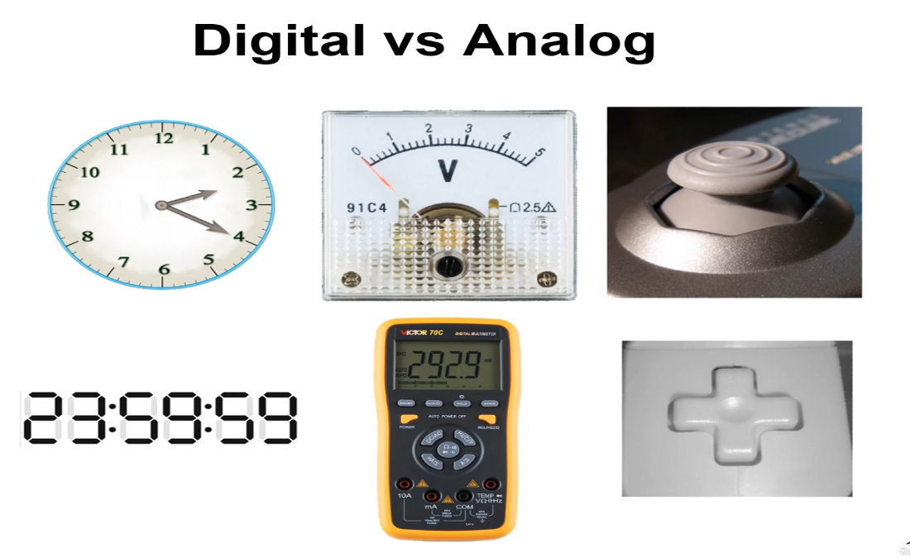

# Digital Logic Design

> - https://www.udemy.com/course/digital-logic-design/learn/lecture/42788982

 

`Digital Circuit`
#

> - Electronic circuit built by interconnection of components (logic gates).
> - Logic gate is an electronic device used to implement a logic operation (AND, OR, NOT).
> - Primitive gates: AND, OR, NOT.
> - Other Gates: NAND, NOR, XOR, XNOR.

 

`Digital Logic Design`:
#

> - A process in which functional design of a digital circuit is represented in terms of logic operations.

 
 
 

# Digital vs. Analog

`Analog Systems`
#

> - Process information having continuous values.
> - Represented using a time-varying quantity such as voltage.
> - Example, audio recordings and playback, older video signal technologies such as VGA, S-Video, etc.

 

`Digital Systems`
#

> - Manipulate information having discrete or discontinuous values.
> - Represented using a discrete set of values.
> - Example: ON/OFF, audio recording from microphone, etc.

 

Examples:
#

 
 
 

#
