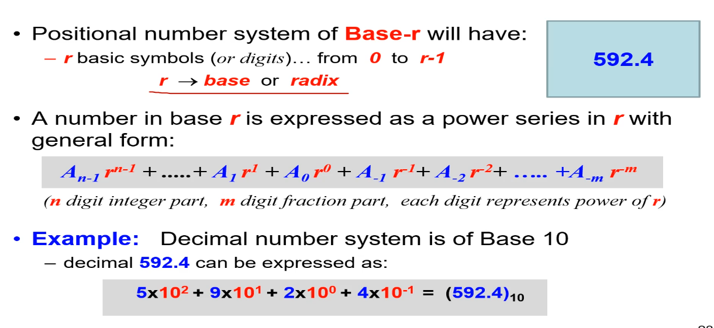
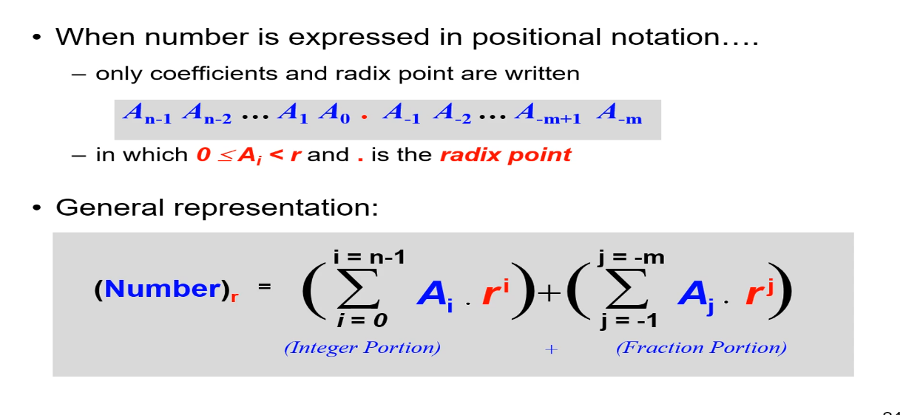
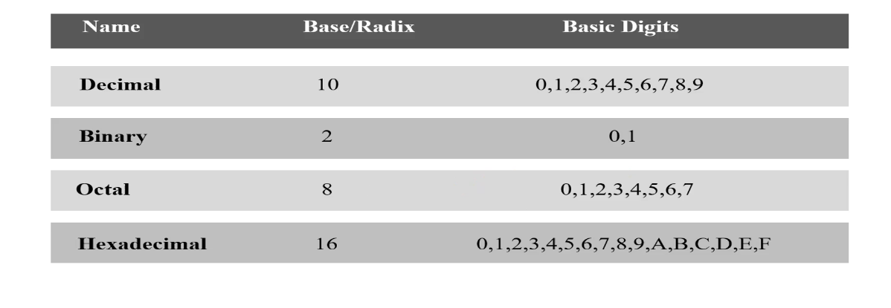

# Digital Logic Design

> - https://www.udemy.com/course/digital-logic-design/learn/lecture/42788982

<br />

`Digital Circuit`
#

> - Electronic circuit built by interconnection of components (logic gates).
> - Logic gate is an electronic device used to implement a logic operation (AND, OR, NOT).
> - Primitive gates: AND, OR, NOT.
> - Other Gates: NAND, NOR, XOR, XNOR.

<br />

`Digital Logic Design`:
#

> - A process in which functional design of a digital circuit is represented in terms of logic operations.

<br />
<br />
<br />


# Digital vs. Analog

`Analog Systems`
#

> - Process information having continuous values.
> - Represented using a time-varying quantity such as voltage.
> - Example, audio recordings and playback, older video signal technologies such as VGA, S-Video, etc.

<br />

`Digital Systems`
#

> - Manipulate information having discrete or discontinuous values.
> - Represented using a discrete set of values.
> - Example: ON/OFF, audio recording from microphone, etc.

<br />

Examples:
#


<br />
<br />
<br />


# Representation of Discrete Information

> - Discrete elements of information are represented in digital systems by combinations of binary values.

```plaintext
- High (1) or Low (0)
```

> - Binary values represented in Digital systems with physical quantities (Binary Signals).

```plaintext
- Example voltage signal.
- Signal has only two discrete values - High (5V) and Low (0V).
```

<br />
<br />
<br />


# Logic Levels

Two types of Logic Levels typically used:
#


<br />
<br />
<br />


# Binary Signals


> - Binary values represented by range of voltage values.
> - Range of output:

```plaintext
HIGH -> 0.9 to 1.0V
LOW  -> -0.1 to 0.1V
```

> - Range of input:

```plaintext
High -> 0.6 to 1.0V
Low  -> -0.1 to 0.4V
```

> - Input range is wider because we cater for variations due to noise and distortion.
> - Why binary signaling and not multilevel?

```plaintext
- Multilevel needs to distinguish between smaller voltage ranges.
- More complex and costly circuitry.
```

<br />
<br />
<br />


# Effect of Noise on Signals


> - Variation in binary signals values when undesired noise voltage is added or subtracted.

<br />
<br />
<br />


# Computer System Design

`Design`
#

> - Understanding relevant constraints (functionality, speed, cost, power, and reliability) of a problem.

<br />

`Complex ICs`
#

> - Billions of transistors.
> - Not designed transistor by transistor.
> - Instead design broken into smaller modules.
> - Modules are then integrated to implement the system.

<br />
<br />
<br />


# Abstraction Layers


<br />

`Layers of Abstractions`
#

> - A mechanism for reducing complexity in computer systems.
> - Processes are divided into several layers of abstraction.
> - Each layer hides the complexity of the layer below.
> - Goal is to hide unnecessary details or reduce complexity.
> - Designer should focus on the problem rather than the unnecessary details.

<br />
<br />
<br />


# Number Systems

`Number System`
#

> - A mathematical notation for representing numbers.

<br />
<br />
<br />


# Positional Systems

> - An elegant notation for representing numbers (Place Value Notation).
> - A number is represented by a string of digits.
> - A digit has an associated value depending on its position in string.



<br />



<br />
<br />
<br />


# Common Occuring Bases

> - The number systems commonly used in computing.


