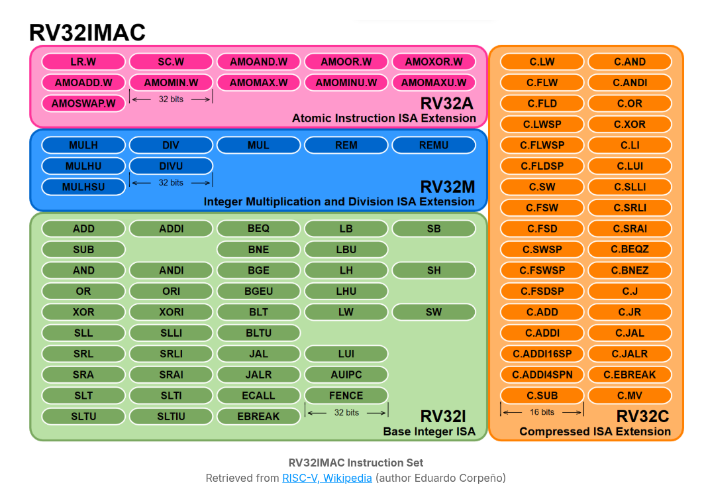

## Introduction

| `Link` |
| ------ |
| [Chapter Overview and Objectives](https://trainingportal.linuxfoundation.org/learn/course/introduction-to-risc-v-lfd110/exploring-the-risc-v-instruction-set-architecture/introduction) |

 
 
 

## RISC-V Specification

| `Link` |
| ------ |
| [The RISC-V ISA Specification Documents](https://trainingportal.linuxfoundation.org/learn/course/introduction-to-risc-v-lfd110/exploring-the-risc-v-instruction-set-architecture/risc-v-specification?page=1) |
| [RISC-V: A Modular ISA](https://trainingportal.linuxfoundation.org/learn/course/introduction-to-risc-v-lfd110/exploring-the-risc-v-instruction-set-architecture/risc-v-specification?page=2) |
|  |
| [RISC-V Instruction Set Architecture Primer](https://trainingportal.linuxfoundation.org/learn/course/introduction-to-risc-v-lfd110/exploring-the-risc-v-instruction-set-architecture/risc-v-specification?page=3) |
| [RISC-V Extensions Lifecycle](https://trainingportal.linuxfoundation.org/learn/course/introduction-to-risc-v-lfd110/exploring-the-risc-v-instruction-set-architecture/risc-v-specification?page=4) |
| [Organizing the Specifications](https://trainingportal.linuxfoundation.org/learn/course/introduction-to-risc-v-lfd110/exploring-the-risc-v-instruction-set-architecture/risc-v-specification?page=5) |

 

| `Documents` |
| ----------- |
| [RISC-V ISA Volume 1](https://drive.google.com/file/d/1uviu1nH-tScFfgrovvFCrj7Omv8tFtkp/view) |
| [RISC-V ISA Volume 2](https://drive.google.com/file/d/17GeetSnT5wW3xNuAHI95-SI1gPGd5sJ_/view) |

 

| `Book` |
| ------ |
| The RISC-V Reader: An Open Architecture Atlas |
