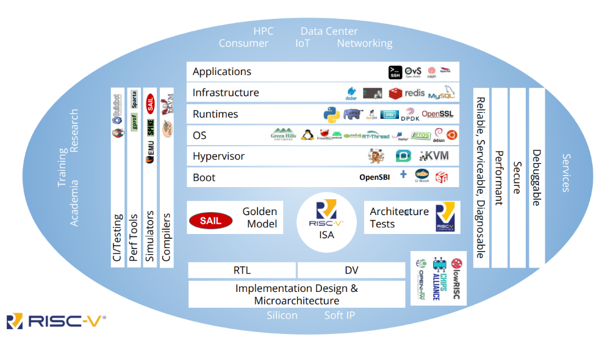

# RISC-V Community Working Model

> https://trainingportal.linuxfoundation.org/learn/course/introduction-to-risc-v-lfd110/getting-to-know-risc-v/the-risc-v-community?page=1

 
 
 

# RISC-V Relationship with the Linux Foundation

> https://trainingportal.linuxfoundation.org/learn/course/introduction-to-risc-v-lfd110/getting-to-know-risc-v/the-risc-v-community?page=2

 
 
 

# RISC-V Ecosystem

> https://trainingportal.linuxfoundation.org/learn/course/introduction-to-risc-v-lfd110/getting-to-know-risc-v/the-risc-v-community?page=3

 

`RISC-V Ecosystem`
#

 
 
 

# Communication Channels

> https://trainingportal.linuxfoundation.org/learn/course/introduction-to-risc-v-lfd110/getting-to-know-risc-v/the-risc-v-community?page=4

 
 
 

# RISC-V Exchange

> https://trainingportal.linuxfoundation.org/learn/course/introduction-to-risc-v-lfd110/getting-to-know-risc-v/the-risc-v-community?page=5

 
 
 

# Contribute to RISC-V

> https://trainingportal.linuxfoundation.org/learn/course/introduction-to-risc-v-lfd110/getting-to-know-risc-v/the-risc-v-community?page=6

 
 
 

# Types of Contributions

> https://trainingportal.linuxfoundation.org/learn/course/introduction-to-risc-v-lfd110/getting-to-know-risc-v/the-risc-v-community?page=7
