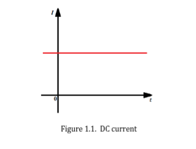
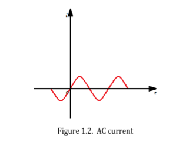
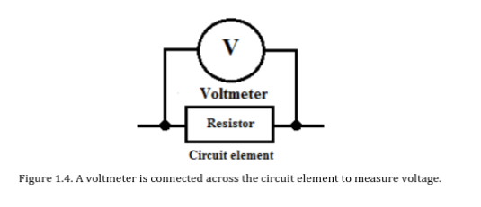
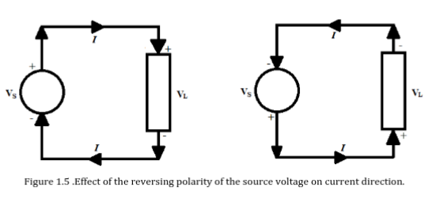

## Charge

| `Electric Charge (Q)` |
| --------------------- |
| Most basic quantity in an electric circuit. |
| Fundamental property of matter that exhibit electrostatic attraction and repulsion. |
| Electrical property of the atomic particles of which matter consists. |

 

| `Coulumb (C)` |
| ------------- |
| Charge of 1 proton = $1.602 \ x \ 10^{-19} \ C$ |
| Charge of 1 electron = - $1.602 \ x \ 10^{-19} \ C$ |
| # of electrons in 1 C (disregard sign) = $\frac{{1 \ C}}{\normalsize{1.602 \ x \ 10^{-19} \ C / e}}$ = $6.242 \ x \ 10^{18}  \ e$ |

| `Additional Information` |
| ------------------------ |
| The law of conservation of charge states that charge can neither be created or   or destroyed but only transferred. |
| Thus, the algebraic sum of the electric charge in a system does not change. |
| It can be converted to another form of energy. |

 
 
 

## Current

| `Current (I)` |
| ------------- |
| The motion of charge through a conducting material or the time rate of change. |
| The current is measured in `ampere (A)`. |
| `Ampere` is the quantity of total charge that passes through an arbitrary cross   section of conducting materials per unit second. |
| Formula: $I \ = \frac{\normalsize{Q}}{\normalsize{t}}$ |
| `I` is the current measured in Ampere (A). |
| `Q` is the charge measured in Columb (C). |
| `t` is the time measured in second |

 

| `Direct Current (DC)` |
| --------------------- |
| A current that remains constant and does not change with time.  |
|  |

 

| `Alternating Current (AC)` |
| -------------------------- |
| A current that varies sinusoidally and does not change with time. |
|   |

 

| `Andre-Marie Ampere (1775 - 1836)` |
| ---------------------------------- |
| Laid the foundation of electrodynamics. |
| He formulated the laws of electromagnetic. |
| He invented the electromagnet and the ammeter. |
| He defined the electric current and developed a way to measure it. |
|  |

 
 
 

## Voltage

| `Voltage` |
| --------- |
| Required energy to move a unit charge through an element. |
| Measured in volt (V). |
| Known as potential difference or electromotive force (emf). |
| Formula: $V \ = \ \frac{\normalsize{W}}{\normalsize{Q}}$ |
| `V` is the voltage measured in Volt (V). |
| `W` is the work or energy measured in Joule (J). |
| `Q` is the charge measured in Coulumb (C). |

 

| `Alessandro Antonio Volta (1745 - 1827)` |
| ---------------------------------------- |
| He invented the electric battery, which proves the continuous flow   of electricity - and the capacitor. |
|  |

 
 
 

## Circuit Loads

| `Load` |
| ------ |
| Generally refers to a component or a piece of equipment connected   to the output of an electric circuit. |
| Is represented by any one or a combination of the following   circuit elements. |
| - `Resistor (R)`   - `Inductor (L)`   - `Capacitor (C)` |
| Can either be resistive, inductive or capacitive nature or   blend of them. |
| For example, a light bulb is purely resistive load whereas a   transformer is both inductive and resistive. |
| Another term for circuit load is `sink` since it dissipates and   the voltage or current supply is also known as `source`. |

 
 
 

## Sign Convention

| `Direction of Current Flow` |
| --------------------------- |
|  |
| It shows a given circuit whereas the current direction depends   on the polarity of the source voltage. |
| Current always flow from `positive (high potential)` to the   `negative (low potential)` side of the source.  |
| In source, current leaves from the positive terminal and in   load `sink`, current enters to the positive terminal. |
