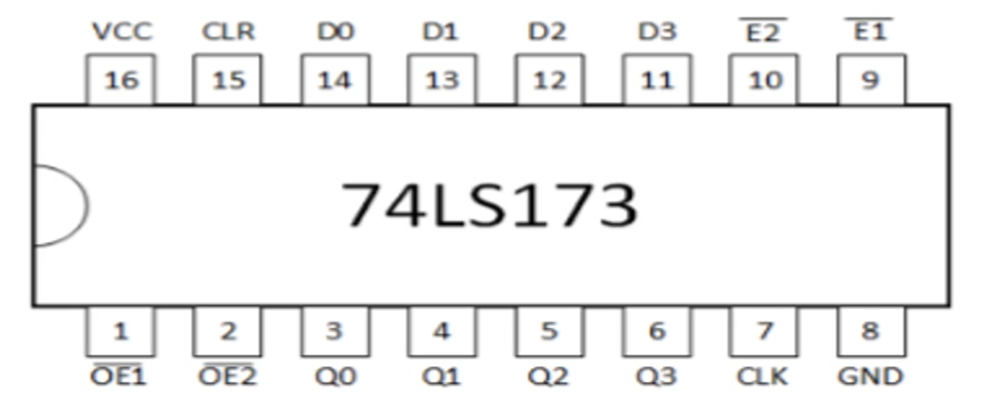
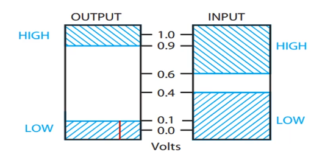
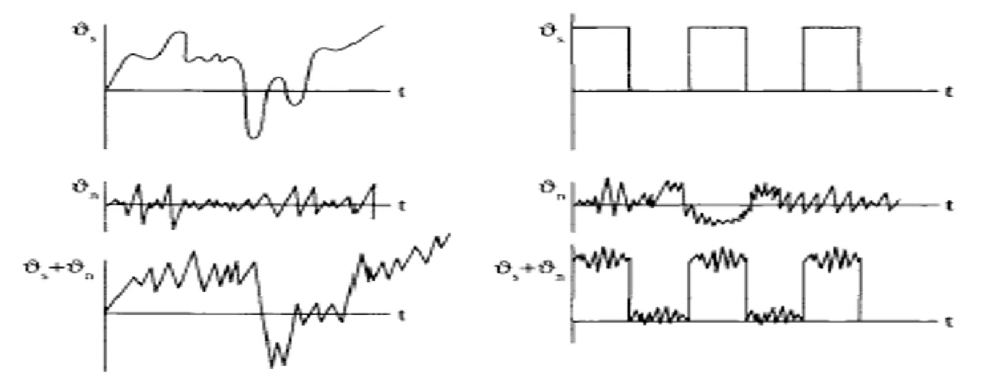
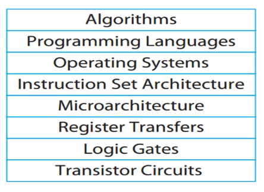

## Digital Logic Design

<br />

`Digital CIrcuit`

> - Electronic circuit built by interconnection of components (`Logic Gates`).

> - `Logic Gate` is an electronic device used to implement a logic operation <br />
    (AND, OR, NOT).

> - Primitive gates.

> - Other gates: `NAND`, `NOR`, `XOR`, `XNOR`.

<br />
<br />

`Digital Logic Design`

> - Process in which functional design of a digital circuit is represented <br />
    in terms of logic operations.

<br />
<br />
<br />


## Digital vs. Analog

<br />

`Analog Systems`

> - Process information having continuous values.

> - Represented using a time-varying quantity such as voltage.

> - Examples: audio recordings and playback, older video signal technologies <br />
    (such as VGA, S-video, etc.).

<br />
<br >

`Digital Systems`

> - Manipulate information having discrete or discontinuous values.

> - Represented using discrete set of values.

> - Example: ON/OFF switch, audio recording from microphone, etc.

<br />
<br />
<br />


## Representation of Discrete information

> - Discrete elements of information are represented in digital systems <br />
    by combinations of binary values (`High (1)` or `Low (0)`).

> - Binary values represented in Digital systems with physical <br />
    quantities (`Binary Signals`).

> - Examples: voltage signal.

> - Signal has only two discrete values - `High (5V)` & `Low (0V)`.

<br />
<br />
<br />


## Two Types of Logic Levels

(1) `ACTIVE HIGH`

> - `TRUE` or `1` generally associated with `H` ( $RST$ ) .

> - The signal will be performing its function when its <br />
    logic level is `1`.

> - Here `5V` represents a digital `1`, and `OV` represents <br />
    a digital `O`.

<br />
<br />

(2) `ACTIVE LOW`

> - `TRUE` or `1` generally associated with `L` ( $\overline{RST}$ )

> - The signal will be performing its function when the <br />
    signal is `0`.

> - Here `5V` represents a digital `0`, and `0V` represents <br />
    a digital `1`.

<br />
<br />

| Example: `74LS173` |
| ------------------ |
|  |
| The `ACTIVE HIGH` logic signals are `Q0`, `Q1`, `Q2`, `Q3`, `CLK`, <br /> `GND`, `VCC`, `CLR`, `D0`, `D1`, `D2`, and `D3`. If you provide <br /> `5V` to them they will perform there functionality, if you  <br /> provide `0V` to them they won't perform there functinality. |
| The `ACTIVE LOW` logic signals are `E2`, `E1`, `OE1`, and `OE2`. <br /> They will perform there functionality if there value is `0V`. |

<br />
<br />
<br />


## Binary Signals

> - Binary values represented by range of voltage values.

<br />

| Example |
| ------- |
|  |

> - Range of output based on image above:

```plaintext
- (HIGH) 0.9V to 1.0V
- (LOW) -0.1V to 0.1V
```

> - Range of input based on image above:

```plaintext
- Caters for variations due to noise and distortion.
```

> - Why binary signaling and not multilevel?

```plaintext
- Multilevel needs to distinguish between smaller voltage ranges.
- More complex and costly circuitry.
```

<br />
<br />
<br />


## Effect of Noise on Signals

> - Variation in binary signal values when undesired noise voltage <br />
    is added or subtracted.

| Noise on Signals |
| ---------------- |
|  |

<br />

> - In Electronics interference signals are called `Noise`.

> - The digital signal and noise are added which result to `Resultant Signal`.

<br />
<br />
<br />


## Computer System Design

<br />

`Design`

> - Understanding relevant constraints of a problem, these includes, <br />
    `Functionality`, `Speed`, `Cost`, `Power`, and `Reliability`.

> - Finding a solution that balances those constraints.

<br />

`Complex ICs`

> - Billions of transistors.

> - Not designed transistor by transistor.

> - Instead design broken into smaller modules.

> - Modules are then integrated to implement the system.

> - Most likely, the design based on Heirarchical design.

> - `Heirarchical Design` is a systematic way of organizing complex <br />
    systems into smaller, more manageable units.

<br />
<br />
<br />


## Abstraction Layers

<br />

`Layers of Abstraction`

> - A mechanism for reducing complexity in computer systems.

> - Processes are divided into several layers of abstraction.

> - Each layer hides the complexity of the layer below.

> - Goal is to hide unnecessary details / reduce complexity.

> - Designer should focus on the problem rather than the unnecessary details.

| Abstraction Layers |
| ------------------ |
|  |

> - Operating systems comprise of set of instructions which are specific <br />
    to processor that are running them.

> - This instructions are called `Instruction Set Architecture (ISA)`.

> - The processor hardware is the specific implementation of the `ISA` <br />
    and is called the `Microarchitecture`.

> - A `Microarchitecture` is a sequence of transfer between the registers <br />
    of the processor.

> - These `Register Transfers` can be decomposed into logic operations performed <br />
    by the logic gates.

> - These `Logic Gates` are electronic circuits which are implemented using <br />
    a transistor circuits.
