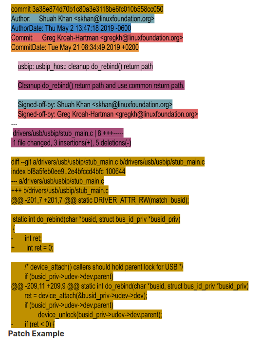

## $\textnormal{What's in a Patch}$

> - You can take a look at a real commit on the next page.

> - In the screenshot we highlighted individual components, and we will walk through
    these individual components as well. We used:

```bash
git format-patch -1 --pretty=fuller 3a38e874d70b
```

> - To generate the patch you will see on the next patch and get the complete
    information about this patch.

<br />



<br />

```plaintext
Patch Components
    Commit ID
        - The auto-generated SHA 1 hash is generated from a cryptographic hash function
          that has all the important information about the patch, such as the commit
          date, the committer's name and email address, the log message, and more.
        - Changing any of the information associated with the Commit ID results in
          changing it.
        - This makes it a tamperproof fast way to compare two commits using the IDs, and
          git pull requests become fast and efficient.

    Commit Header
        "major subsystem: minor area: short description of what is being changed"
        "usbip: usbip_host: cleanup() do_rebind() return path"

        - As you can see in the image provided above, the patch changes the "usbip_host"
          driver, which is a sub-driver of the "usbip" driver.
        - This driver falls under the drivers/usb subsystem.
        - The author of the patch writes this information in a standard format with ":"
          separating the major and minor subsystem fields.
        - You will also see "/" as a separator, which would look like
          "usbip/usbip_host: cleanup do_rebind() return path" instead of
          "usbip: usbip_host: cleanup do_rebind() return path".
        - Using "/" or ":" is determined by the maintainer's preference. If in doubt,
          refer to a few patches for the subsystem for information on individual preferences.

    Commit Log
        - It provides a detailed description of the change and why the change is made.
        - Alternate design choices if any are considered.
        - Detailed about the testing done.
        - The example we provided shows a small change and the commit log is simple and to
          the point.
        - Commit logs can be long for patches that fix panics, as they include panic stack
          traces.
        - We encourage you to take a look at a few commit logs in the kernel source
          repository to get a better understanding of the kind of information that is relevant
          to include in them.

    Author
        - This componennt provides the author's name and email information.
        - This information can be specified when you run "git commit" or it can be configured
          in your ".gitconfig" file, which is a very convenient way to generate commits.

    Author Date
        - Auto-generated commit time and date.
        - This value comes from the system time of your computer when you create the change.

    Commit
        - The committer's name and email address.
        - The committer is a maintainer or developer that applies the patch to a git
          repository.
        - This patch was picked up by the USB maitainer Greg Kroah-Hartman and committed to
          the usb tree and tested prior to being included in a pull request from Greg KH to
          Linus Torvalds.
        - Since it was pulled, you won't see Linus as the committer for this patch.
        - If you look at the git log, you will see several merge commits from Linus for when
          he pulls subsystem trees from maintainers.

    CommitDate
        - Auto-generated commit time and date when Greg KH applied this patch to the usb tree.
        - You will notice that there is a difference of 19 days between the initial commit
          date and the commit date when the patch was applied to the usb tree.
        - This is not unusual, depending on where things are in the release cycle.
        - Merge windows and quiet periods could delay a patch from being applied.

    Signed-off-by
        - Using sign-off, developers certify the patch to be their original work or have the
          right to pass it on as an open source patch.
        - In our example, the author signed off and then, as the usb maintainer, Greg KH
          signed-off on the patch.
        - https://www.kernel.org/doc/html/latest/process/submitting-patches.html#sign-your-work-the-developer-s-certificate-of-origin
```
