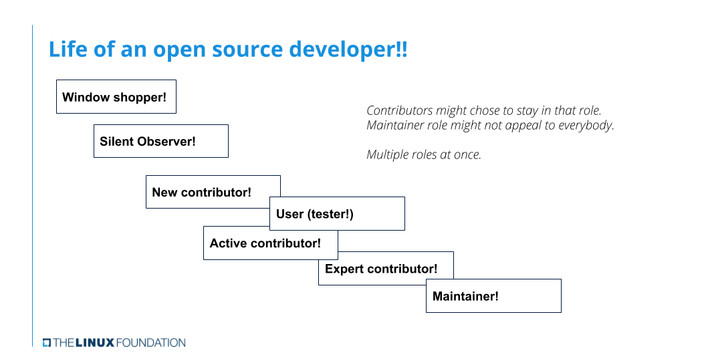

# Life of an Open Source Developer

> - Here is my view of the life of an open source <br />
    developer, derived from my experience as a <br />
    Linux kernel developer/maintainer.

| Life of an Open Source Developer |
| -------------------------------- |
|  |

<br />

> - I consider myself as playing multiple roles at once.

> - I am a new contributor to some areas of the kernel,
    and, at the same time, an active one in others.

> - I have expertise in some areas and maintain a few of them.

> - I participate in the stable release maintenance <br />
    process, assisting stable release maintainer(s).

> - Place yourself in the picture on the previous page.

> - Maybe you are in a window shopper role and/or a <br />
    silent observer role.

> - As you transition to a new contributor, you might <br />
    choose to wear your user/tester hat for a while, <br />
    as you get to know the kernel.

> - Many people ask me `“how does one become a maintainer?”` <br />
    There are many paths to choose from.

> - A few paths that lead you there:

```plaintext
- Write a new driver.
- Adopt an orphaned driver or a module (Hint: Check the MAINTAINERS file).
- Clean up a staging area driver to add it to the mainline.
- Work towards becoming an expert in an area of your interest by fixing bugs, doing reviews, and making contributions.
- Find a new feature or an enhancement to an existing feature that is important to the kernel and its ecosystem.
- Remember that new people bringing new and diverse ideas make the kernel better. We, as a community, welcome and embrace new ideas!
```

<br />

> - Keep in mind that the maintainer role is hard. <br />

> - It is a very challenging job.

> - However, if you have the tenacity, it is very fulfilling as it <br />
    gives the best opportunity to change and influence the <br />
    direction of the kernel and benefit the ecosystem.

> - The power of this role comes with a great responsibility to <br />
    model and to follow the principles laid out in the Code <br />
    of Conduct and embrace it.

> - There are several ways you can engage in the kernel development process.

> - Participating in the Stable release process can help you <br />
    understand how it works, and how fixes flow from the the <br />
    mainline kernel into stable releases.

> - You can also find problems and report them.

> - Next, we will see how we can go about doing that.
