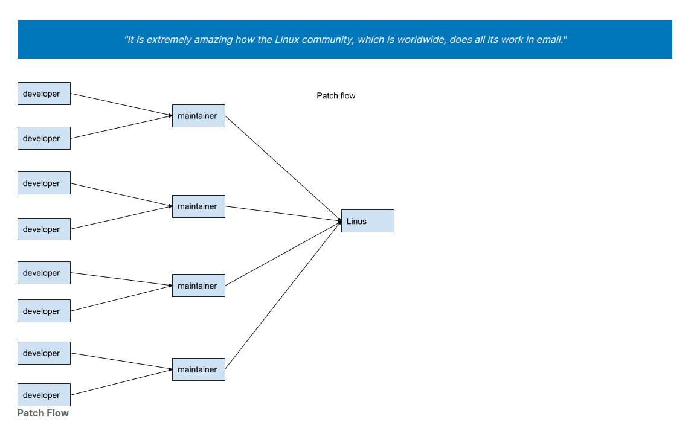

## $\textnormal{Subsystem Maintainers}$

> - Each major subsystem has its own tree and designated maintainer(s).

> - Subsystems may have multiple maintainers.

> - You can find a list of subsystem and their maintainers in the `MAINTAINERS file` in the
    kernel source.

```bash
https://www.kernel.org/doc/linux/MAINTAINERS
```

> - In addition, almost every kernel subsystem has a mailing list.

> - Please refer to the `Linux Kernel Mailing Lists` and the `List Archives on lore.kernel.org`
    for a list of mailing lists and their archives.

```bash
Linux Kernel Mailing Lists: http://vger.kernel.org/vger-lists.html
List Archives on lore.kernel.org: https://lore.kernel.org/lists.html
```

> - Archives are a great reference for patch discussions and history of changes.

> - The development process itself happens entirely over emails.

> - Contributors send patches to mailing lists through email, and contributions are then
    discussed through emails.

> - Most maintainers send an email response to contributors saying `Applied to tree-name` or
    `Thanks Applied` to contributors when they accept and commit patches.

> - Some maintainers have a bot that will send patch applied notifications with the patch
    included in them.

> - Please refer to the `kernel.org git repositories` for a list of kernel trees.

```bash
kernel.org: https://git.kernel.org/
```

> - Not all trees are on `kernel.org`.

> - You can find subsystem git information and mailing lists for each of the subsystems in
    the `MAINTAINERS file`.

> - You can refer to `A guide to the Kernel Development Process` for additional information.

```bash
Kernel Development Process Guide: https://www.kernel.org/doc/html/latest/process/development-process.html
```

> - Below is a new developer observed:

| Development Patch Flow |
| ---------------------- |
|  |
