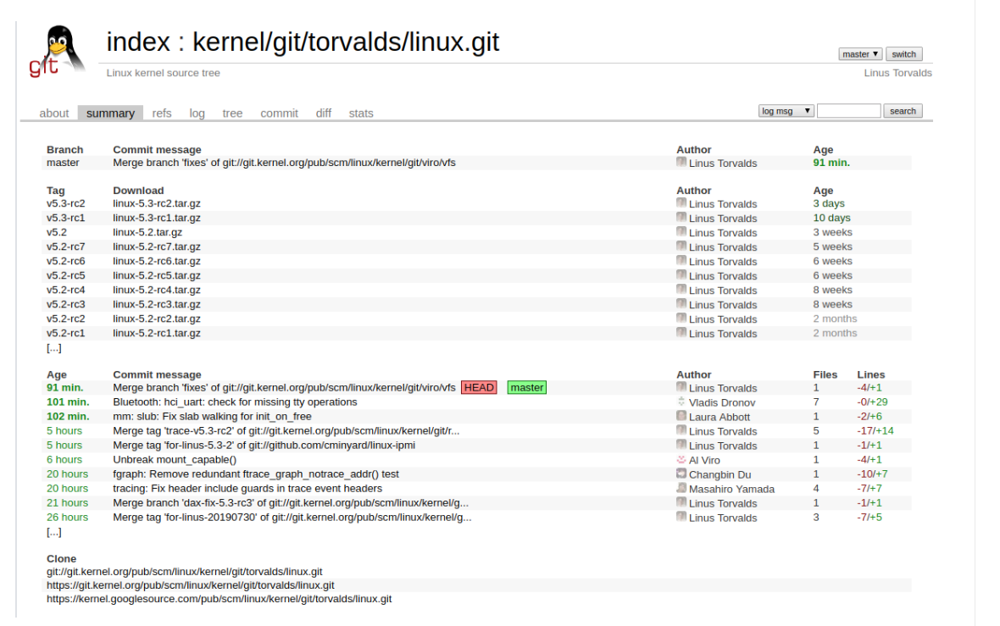

## $\textnormal{Linux Mainline}$

> - Latest stable and mainline releases.

```plaintext
https://www.kernel.org/
```

> - Linus's tree or mainline.

```plaintext
https://git.kernel.org/pub/scm/linux/kernel/git/torvalds/linux.git/
```

<br />

| Linux Mainline |
| -------------- |
|  |
