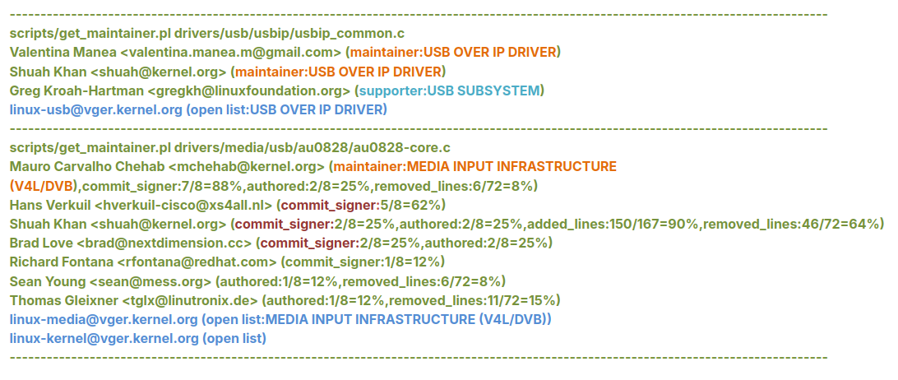

## $\textnormal{Sending a Patch for Review}$

> - So far, you learned how to make a change, check for <br />
    coding style compliance, and generate a patch.

> - The next step is learning the logistics of how to <br />
    send a patch to the Linux Kernel mailing lists <br />
    for review.

> - The `get_maintainer.pl` script tells you whom to <br />
    send the patch to.

> - The two example runs of `get_maintainer.pl` show the <br />
    list of people to send patches to.

> - You should send the patch to maintainers, commit <br />
    signers, supporters, and all the mailing lists shown <br />
    in the `get_maintainer.pl` output.

> - Mailing lists are on the `“cc”` and the rest are on <br />
    the `“To”` list when a patch is sent.

| Mailing List 1 |
| -------------- |
|  |

<br />

> - Now let’s run the `get_maintainer.pl` script on your changes.

| Mailing List 2 |
| -------------- |
|  |

<br />

> - As this time, you can run:

```sh
git format-patch -1 <commit ID> --to=laurent.pinchart@ideasonboard.com --to=mchehab@kernel.org --cc=linux-media@vger.kernel.org --cc=linux-kernel@vger.kernel.org
```

> - This will generate a patch. You can send this patch using:

```sh
git send-email <patch_file>
```

> - You won’t be sending this patch and you can revert this commit.

> - Please refer to the Select the recipients for your patch <br />
    section in the Submitting patches: the essential guide to <br />
    getting your code into the kernel document.

```plaintext
Select the Recipients for your Patch: https://www.kernel.org/doc/html/latest/process/submitting-patches.html#select-the-recipients-for-your-patch
Submitting Patches: Essential Guide: https://www.kernel.org/doc/html/latest/process/submitting-patches.html#submitting-patches-the-essential-guide-to-getting-your-code-into-the-kernel
```
