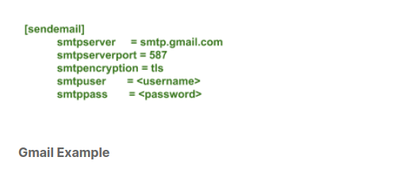

## $\textnormal{Git Email Configuration}$

> - Configuring `git-email` to send patches is easy using the `sendemail` configuration option, once you have
    your `smtp` server configuration.

> - There is a wealth of online resources for obtaining information on configuring `get sendemail` to send
    patches.

> - Once you place the above configuration in your `.gitconfig` file, running `git send-email mypatch.patch` is
    all you have to do to send patches; `mypatch.patch` is generated by the `git format-patch` command.

