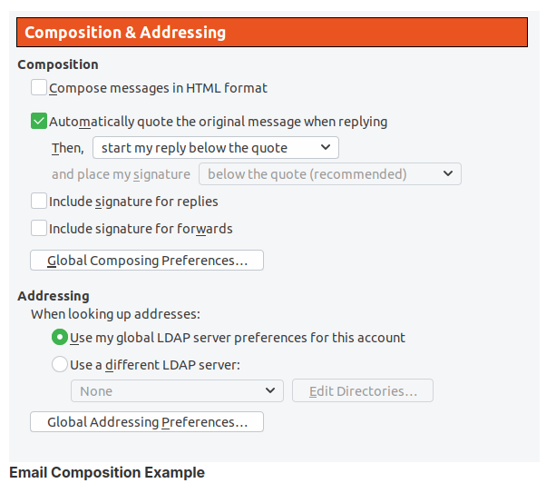

## $\textnormal{Email Client Configuration}$

> - Click this [link](https://trainingportal.linuxfoundation.org/learn/course/a-beginners-guide-to-linux-kernel-development-lfd103/configuring-your-development-system/configuring-your-development-system?page=3).

> - You still have to configure your email client to be able to send responses, to review comments, and
    other communication with the community.

> - Things to remember:

```plaintext
Bottom Post
    - Never top post in your response.
    - Top posting is writing a message above the original
      text while sending a response to an email.
    - Add your response at the bottom of the original text.
    - Bottom posting makes it easier to read and follow
      review comments on a patch.

Inline Post
    - When reviewing or responding to a patch, deleting or
      stripping parts of the message you are not replying
      to is a good practice, and makes it easier to follow
      the responses in the thread.

No HTML Format
    - Disable compose messages in HTML format.
    - Patches sent using HTML format will be rejected by
      the development mailing lists automatically.

No Signatures
    - Do not include private information in your signature.
    - This is important for privacy reasons, as you are
      going to be posting to mailing lists.

No Attachments
    - Do not send patches as attachments.
    - In general, avoid attachments. Some exceptions are
      kernel logs or configuration files when reporting bugs.
```

> - You should refer to [Email clients info for Linux](https://www.kernel.org/doc/html/latest/process/email-clients.html) for more details.

> - You will have to generate an app-specific password for <br />
    authentication if you have 2-factor on your Gmail account.

> - Please refer to the Examples in [this document](https://git-scm.com/docs/git-send-email) for more information.

| Example Thunderbird Configuration|
| -------------------------------- |
|  |
