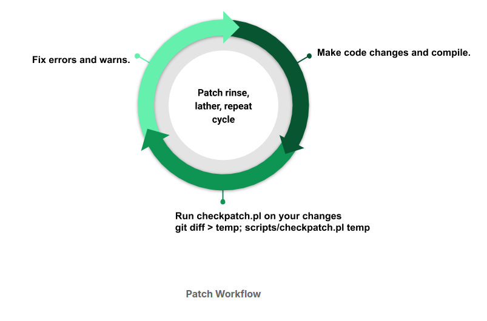

## $\textnormal{Practicing Commits}$

> - You can see the files you modified by running <br />
    the `git status` command.

> - Let's first check if your changes follow the <br />
    coding guidelines outlined in the Linux kernel <br />
    coding style guide.

```plaintext
Linux Kernel Coding Style Guide: https://www.kernel.org/doc/html/latest/process/coding-style.html
```

> - You can run `checkpatch.pl` on the diff or the <br />
    generated patch to verify if your changes comply <br />
    with the coding style.

```plaintext
checkpath.pl: https://git.kernel.org/pub/scm/linux/kernel/git/torvalds/linux.git/tree/scripts/checkpatch.pl
```

> - It is good practice to check by running `checkpatch.pl` <br />
    on the diff before testing and committing the changes.

> - I find it useful to do this step even before I <br />
    start testing my patch.

> - This helps avoid redoing testing in case code changes <br />
    are necessary to address the `checkpatch` errors and <br />
    warnings.

> - You can see my patch workflow below.

| Patch Workflow |
| -------------- |
|  |

<br />

> - Make sure you address `checkpatch` errors and/or warnings.

> - Once `checkpatch` is happy, test your changes and commit <br />
    your changes.

> - If you want to commit all modified files, run:

```sh
git commit -a
```

> - If you have changes that belong in separate patches, run:

```sh
git commit <filenames>
```

> - When you commit a patch, you will have to describe what <br />
    the patch does.

> - The commit message has a subject or short log and longer <br />
    commit message.

> - It is important to learn what should be in the commit log <br />
    and what doesn’t make sense.

> - Including what code does isn’t very helpful, whereas why <br />
    the code change is needed is valuable.

> - Please read How to Write a Git Commit Message for tips on <br />
    writing good commit messages.

```plaintext
How to Write a Git Commit Message: https://cbea.ms/git-commit/
```

> - Now, run the commit and add a commit message.

> - After committing the change, generate the patch running the <br />
    following command:

```sh
git format-patch -1 <commit ID>
```
