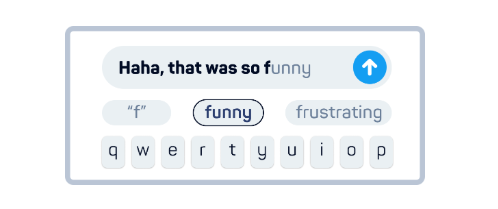
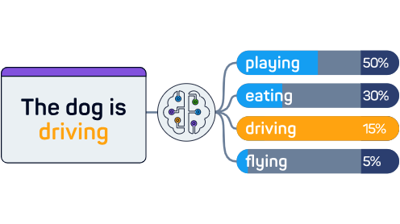
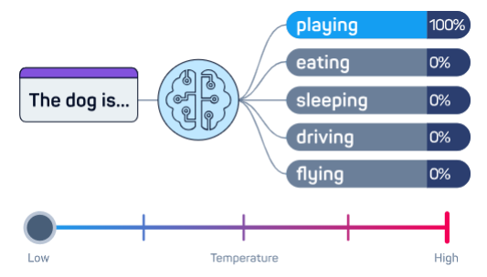
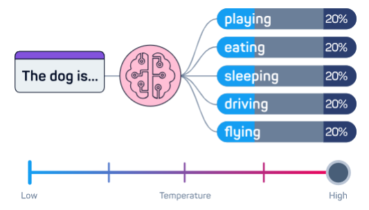

# Large Language Model (LLM)

> - https://www.sololearn.com/en/learn/courses/llms-ai/lesson/5131475774?p=1
> - Enables computers to understand and generate human like text.

 

`Language Model`
#

> - A program that can figure out which words are most likely to come next.

 

`Corpus`
#

> - A body of texts where a languaged learned.
> - Because certain words usually come after others in a specific context or corpus, a language model can use this to predict the next word.

 

How does AI choose the next word?
#

> - The language model measures how often words follow other words and sequences in the corpus.
> - It then calculate the probabilities.
> - To better understand the predictions, probabilities, are represented with percentages.
> - Once the language model chooses the next word, that word gets added to the text.
> - The model repeats this process for each new word, until it has generated the complete output (a sentence, email, story, etc.).

 

`Temperature`
#

> - It influences how random (or "creative") the outputs are.
> - Higher temperature results in more random and unpredictable output, because it fattens the probability distribution.
> - Conversely, a lower temperature makes the output more focused, deterministic, and repetitive by sharpening the probability distribution and favoring the most likely words.

