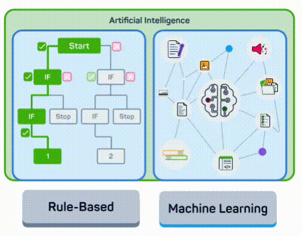

# AI versus GenAI

> - https://www.sololearn.com/en/learn/courses/llms-ai/lesson/5131475777?p=1

 

`Artificial Intelligence`
#

> - Artificial intelligence refers to technology that brings machines closer to what human minds can do.
> - Its an umbrella term.
> - It encompasses two big categories:

(1) **Rule-based AI**: Relies on predefined logical.  
(2) **Machine Learning**: Learns from data patterns.

 

`Rule-based AI`
#

> - Based on guidelines and criteria defined by humans.

 

`Machine Learning`
#

> - Two types of machine learning:

(1) **Discriminative AI**: Learns boundaries between different classes of data.  
(2) **Generative AI**: Produces new data.

