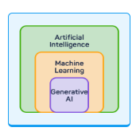
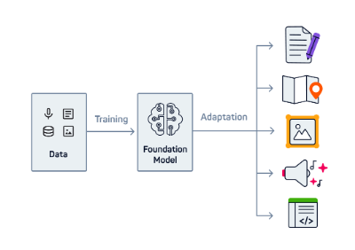
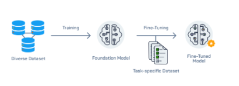

# How to Train GenAI

> - https://www.sololearn.com/en/learn/courses/llms-ai/lesson/5131475779?p=1
> - GenAI learns from a vast amount of data from a diverse range of sources.
> - GenAI is within the ML category because it's trained on data.
> - An LLM is an ML model that can predict the next word.
> - Requires human involvement to label the training data.
> - An LLM is trained in different phases.
> - In phase one (unsupervised learning), it's trained on a vast and diverse corpus of unlabelled text data, to learn patterns and structures.
> - (Supervised learning) Once an LLM has been trained to be able to predict the next word, it then gets trained with labeled conversations, to learn to follow human instructions and perform new tasks.

 

`Foundational Models`
#

> - They are very versatile ML model that can be used in various applications for a wide range of tasks.
> - They are general-purpose and highly adaptable.
> - GenAI will soon be able to comprehend language, visual imagery and sound all at the same time.

> - **Fine-tuning** is the process of further training a generic foundation model with more specific data, so that it becomes more skilled at certain tasks.
> - GPT stand for **Generative Pre-trained Transformer**, which means, you can train or customize it even more.
> - Example a GPT model that has been further trained on legal documentation to be able to understand and explain legal terminology.
> - A foundation model is a **generalist** after pre-training and becomes a specialist after **fine-tuning**.
