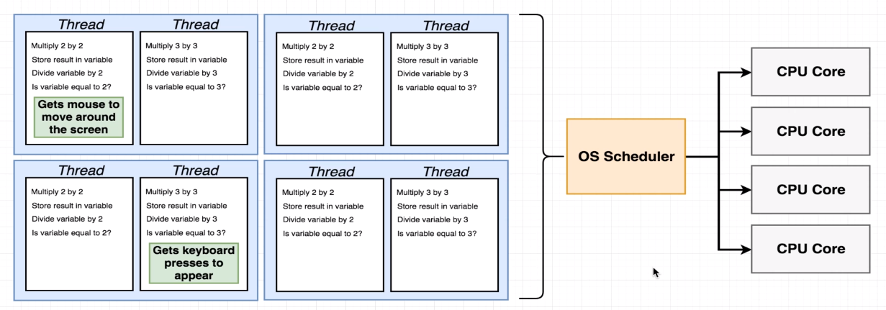

### EVENT LOOP
#
> - Used by `Node.js` to handle asynchronous code inside the applications.

 
 

### THREADS
#

 

 

 

> - A `process` is an instance of a computer program that is being executed.

> - Within a single process we can have multiple things called `threads`.

> - The thread is given to the CPU and the CPU will attempt to run every
    instructions on it, one by one, starting at the top and then going
    down.

> - `Scheduling` is your OS ability to decide which thread to process at any
    given instant at time.

 

 

 

> - One CPU core can process more than one thread at a time through a called
    `Multi-threading` or might be called as `Hyperthreading` as well.

 

 

> - Any time a computer tries to read data off of some type of medium like a
    a hard drive, it is considered as I/O operations. This always takes some
    non-zero amount of time. During an I/O phase above, the CPU is waiting on
    the hard drive to read some file and return its contents, and during that
    time, thread number one has nothing else to do, its sitting there waiting
    for hard drive for information.

> - Operating system scheduler has the ability to detect downtime or pause
    between instructions, and it can decide to put thread number one on pause,
    and then execute thread number two. Once thread number two is complete
    it can go back to thread number one and continue waiting for the hard drive
    to be read.

> - `Threads` are unit of instructions that are waiting to be executed by
    the CPU.

> - `Scheduler` are controlled by the operating system.
