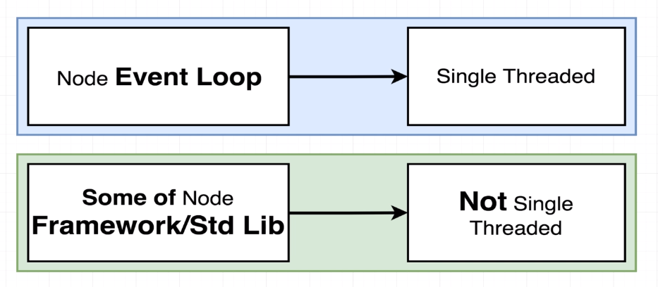
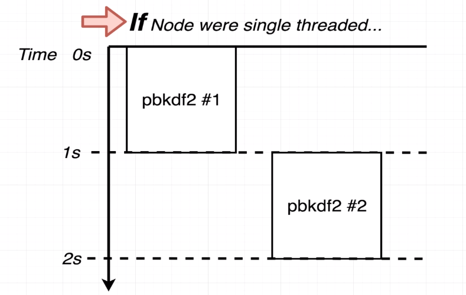
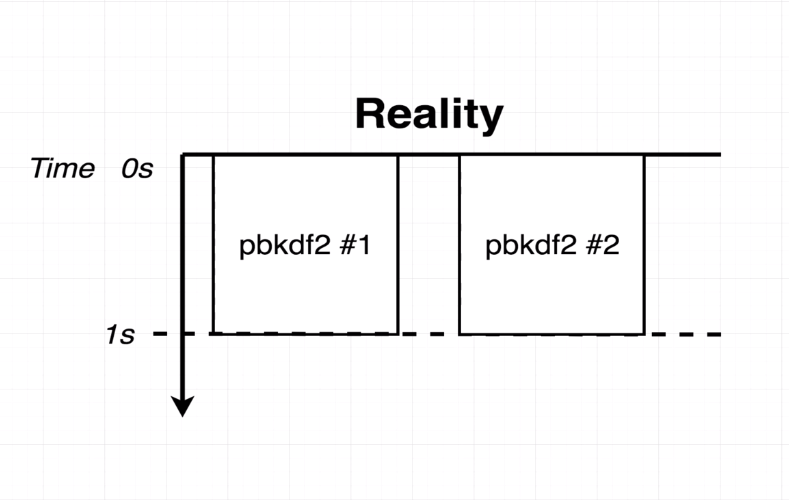

### NODE SINGLE THREAD
#

 

 

> - The Node `Event Loop` is single threaded.

> - When starting a node program, a single instance of the event loop is created
    and placed into one thread.

> - It's commonly seen as kind of a bad thing, it means that the program can only
    run on one core of CPU.

> - Node is not going to automatically take advantage of multi-core capabilities.

> - However, some of the functions that are included inside the standard library
    of node are not actually single-threaded.

> - Some of the functions that are included inside of Node that we run outside
    of the event loop and outside of that single thread.

> - Declaring that `Node.js` is single-threaded is not absolutely true.

> - Example is in the `code-thread.js` file.

> - In the example `code-thread.js` both the `SAMPLE #1` and `SAMPLE #2` will be
    invoked at more or less the exact same time. The `SAMPLE #1` is not going to
    wait for the `SAMPLE #1` to finish up.

 

 

 

> - The code on the `code-thread.js` is not clearly what occur in based on the diagram.

 

 

> - What really happens on the `code-thread.js` is based on the diagram above. We started
    our program at 0s, and then it took exactly 1s for both of those function calls to
    get to the call back. This indicate that something is happening that we are breaking
    out of a single thread setup with node. If we only have one single thread we would've
    seen the first function call complete and then second one start up.
