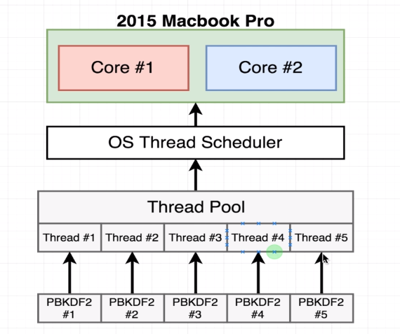

### CHANGING THREAD POOL SIZE
#
> - This will refer to the code sample `code-thread-3.js`.

 

 

> - Based on the diagram above, the 1st call will get assigned
    to `thread #1` and the 2nd call will get assigned to
    `thread #2`.

> - After the hashing of `thread #1` and `thread #2` is completed, the
    3rd and 4th call will get assigned to the `thread #1` and `thread #2`.

 

 

> - Based on the diagram above, if you increase the thread pool size to 5,
    the 5 calls will get assigned each of the thread at the same time.
