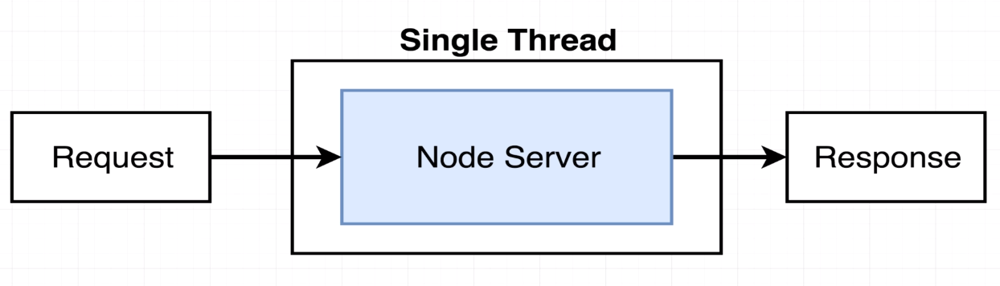

### BLOCKING THE EVENT LOOP
#

 

 

> - Based on the diagram above, whenever some request comes into our server
    it gets processed inside of one single thread that contains our event
    loop.

> - Refer to the `code-index.js`.

> - The `doWork` function will block the event loop, it will wait for the
    while to complete before proceeding to send the response.

> - The entire server cannot do nothing else while waiting for the `doWork`.
