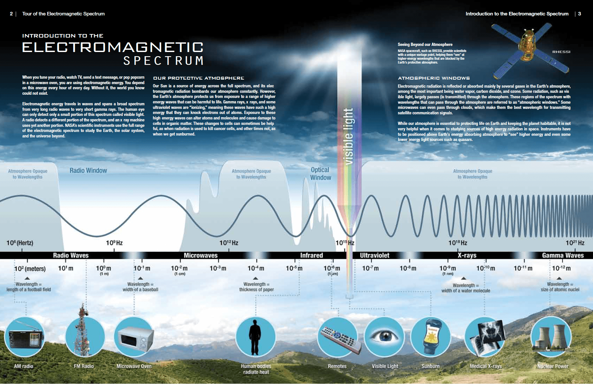

## What is Electromagnetic Energy

> - https://science.nasa.gov/ems/01_intro/

 

`Electromagnetic Energy`
#

> - It travels in waves and spans a broad spectrum from very long radio waves to very short gamma rays.
> - The human eye can only detect only a small portion of this spectrum called visible light.
> - A radio detects a different portion of the spectrum, and an x-ray machine uses yet another portion.
> - When you tune your radio, watch TV, send a text message, or pop popcorn in a microwave oven, you are using electromagnetic energy.

 

`Electromagnetic Spectrum`
#

 

`Our Protective Atmosphere`
#

> - Our Sun is a source of energy across the full spectrum. and its electromagnetic radiation bombards our atmosphere constrantly.
> - However, the Earth's atmosphere protects us from exposure to a range of higher energy waves that can be harmful to life.
> - Gamma rays, x-rays, and some ultraviolet waves are "ionizing", meaning these waves have such a high energy that they can knock electrons out of atoms.
> - Exposure to these high-energy waves can alter atoms and molecules and cause damage to cells in organic matter.
> - These changes to cells can sometimes be helpful, as when radiation is used to kill cancer cells, and other times not, as when we get sunburned.

 

`Atmospheric Windows`
 

> - These are the regions of the spectrum with wavelengths that can pass through the atmosphere.
> - Electromagnetic radiation is reflected or absorbed mainly by several gases in the Earth's atmosphere, among the most important being water vapor, carbon dioxide, and ozone.
> - Some radiation, such as visible light, largely passes (is transmitted) through the atmosphere.
> - Some microwaves can even pass through clouds, which make them the best wavelength for transmitting satellite communication signals.
> - However, it is not very helpful when it comes to studying sources of high-energy radiation in space.
> - Instruments have to be positioned above Earth's energy absorbing atmosphere to "see" higher energy and even some lower energy light sources such as quasars.
