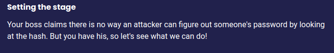
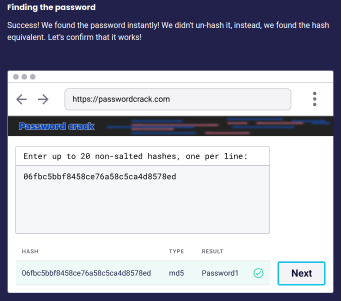

## $\textnormal{Insecure Hash in Action}$

> - Below is a hash function that uses MD5 to hash <br />
    the user's password before it gets stored in the <br />
    database.

```go
import (
    "crypto/md5"
    "encoding/hex"
)

func main() {
  var password = r.Form.Get("password")
  hasher := md5.New()
  hasher.Write([]byte(password))
  var MD5Hash =  hex.EncodeToString(hasher.Sum(nil))
}
```

> - The code above will provide the same hash every time you run it.

> - Refer to [code-01.go](./code-01.go) for example.

> - A hash can be compared to known hashes.

> - This might take a lot of effort to brute force some hashes, <br />
    but maybe you just need to look at the most popular passwords <br />
    and hash those.

> - Below is a flow of insecure hash discovery.

| Step 1: Setting the Stage |
| ------------------------- |
|  |

<br />

| Step 2: Searching for the Password |
| ---------------------------------- |
|  |

<br />

| Step 3: Cracking the Hash |
| ------------------------- |
|  |

<br />

| Step 4: Finding the Passowrd |
| ---------------------------- |
|  |

<br />

| Step 5: Successful Attack |
| ------------------------- |
|  |
