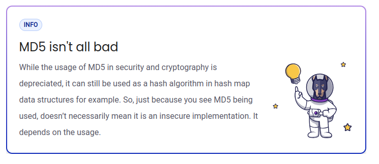

## $\textnormal{What Happened?}$

> - An `MD5` hash can be brute force in a matter of seconds.

> - Hashing passwords is the correct way to handle passwords,  
    but it must be done using a secure hash function.

> - Outdated hash function such as `MD5`, `SHA-`, or some  
    or some others, should be avoided.

> - In Go, you can import the `bcrypt` library to handle all  
    of your cryptography needs.

| MD5 isn't all bad |
| ----------------- |
|  |

