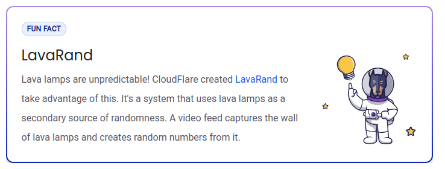

## $\textnormal{What is Insecure Randomness?}$

> - `Insecure Randomness` refers to random numbers or data  
    that do not have enough entropy, or randomness, to be  
    considered truly random.

> - Occurs when a function that is expected to a random value  
    actually has a predictable output, allowing an attacker to  
    compromise security.

> - Computers are not able to produce truly random values due  
    to their deterministic nature, so Pseudo-Random Number  
    Generators are used instead.

> - The predictability of the output of these generators varies  
    significantly.

| Fun Fact |
| -------- |
|  |
| https://blog.cloudflare.com/randomness-101-lavarand-in-production/ |

 
