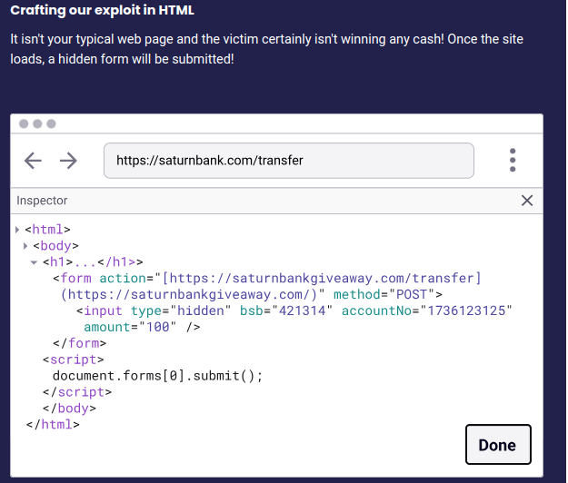

## $\textnormal{CSRF in Action}$

> - A web application is vulnerable to CSRF if it relies  
    on session cookies to identify users, and doesn’t  
    have any other mechanism for validating requests.

| Step 1 |
| ------ |
|  |

 

| Step 2 |
| ------ |
|  |

 

| Step 3 |
| ------ |
|  |

 

| Step 4 |
| ------ |
|  |

 

| Step 5 |
| ------ |
|  |
