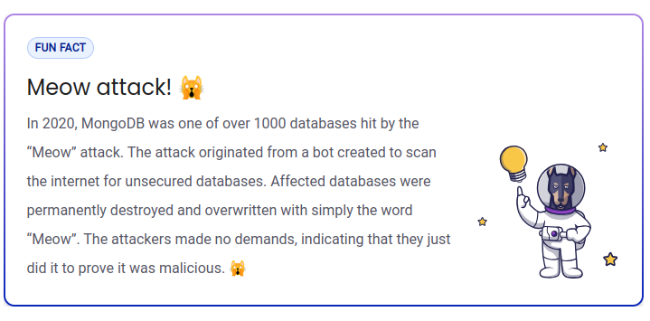

## $\textnormal{What is NoSQL Injection}$

> - NoSQL injection is a type of vulnerability where an  
    attacker is able to inject arbitrary text into NoSQL  
    queries.

> - NoSQL injections are very similar to the traditional  
    SQL injection attack, except that the attack is  
    against a NoSQL database.

| Fun Fact |
| -------- |
|  |

 
