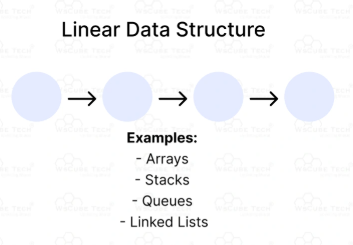
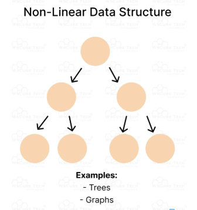

## What is Data Structure?

> - In solving a problem with or without a computer it is necessary <br />
    to choose an abstraction of reality, i.e., to define a set of <br />
    data that is to represent the real situation.

> - When selecting a data structure to solve a problem, you should <br />
    follow these steps:

```plaintext
(1) Analyze your problem to determine the basic operations that
    must be supported. Examples of basic operations include
    inserting a data item into the data structure, deleting a data
    item from the data structure, and finding a specified data item.

(2) Quantify the resource constraints for each operation.

(3) Select the data structure that best meets these requirements.
```

> - `Data Structure` is a way of storing and organizing data in a <br />
    computer so that it can be used efficiently.


> - `Data Structure` is a specialized format for organizing and <br />
    storing data.

> - `Data Structure` types includes arrays, linked list, stacks, <br />
    queues, trees, graphs and so on.

> - The term `Data  Structure` often refers to data stored in a computer's <br />
    main memory.

<br />
<br />


##  Data Structures are Classified into Two Types

<br />

| (1) Linear Data Structure |
| ------------------------- |
| Elements are accessed in a sequencial order but <br /> is not compulsory to store all elements sequentially. |
| Data elements in a linear data structure are <br /> traversed one after the other and only one element can <br /> be directly reached while traversing. |
| All the data items in linear data structure can <br /> be traversed in a single run. |
| Are very easy to implement because memory of <br /> computer is also organized in a linear fashion. |
| Example: `Array`, `Linked List`, `Stack`, and `Queue`. |
|  |

<br />

| (1) Non-linear Data Structure |
| ----------------------------- |
| Elements of this data structure are accessed in <br /> a non-linear order. |
| A data elements of the nonlinear data structure <br /> could be connected to more than one elements to <br /> reflect a special relationship among them. |
| All the data elements in non-linear data <br /> structure cannot be traversed in single run. |
| Examples: `Binary Tree`, `Heap`, `Hash Table`, and `Graph`. |
|  |

<br />
<br />


## Language in Data Structures

<br />

| Ruby and Python |
| --------------- |
| Are high level languages. |
| Can be good but it also be confusing for beginners <br /> and it can be harder to catch errors since <br /> they won't be apparent until runtime. |

<br />

| C |
| - |
| A low level programming language which is very <br /> good in abstraction. |
| Also good in memory management. |
| Not an object oriented programming language. |

<br />

| Java |
| ---- |
| An object oriented programming language. |
| It shows an errors during compiling and even before runtime. |
| Has extremely low memory leak which obviously <br /> can be fixed and has no segmentation faults. |

<br />

| C# |
| -- |
| Similar to Java. |
| More like Java with the capabilities of the modern language. |

<br />

| C++ |
| --- |
| An object oriented programming language and <br /> includes inheritance, polymorphism, data abstraction <br /> and encapsulation. |
| Support easy declaration of data types. |

<br />
<br />


## Concepts of Object Oriented Programming

<br />

| Inheritance |
| ----------- |
| The capability of a class to derive properties <br /> and characteristics from another class. |
| One of the most important features of OOP. |

<br />

| Data Encapsulation |
| ------------------ |
| A mechanism of bundling the data, and the <br /> functions that use them. |

<br />

| Data Abstraction |
| ---------------- |
| A mechanism of exposing only the interfaces and <br /> hiding the implementation details from the user. |
| Data abstraction refers to providing only essential <br /> information about the data to the outside world, <br /> hiding the background details or implementations. |

<br />

| Polymorphism |
| ------------ |
| Having many forms. Typically, polymorphism occurs when <br /> there is a heirarchy of classes and they are related by inheritance. |
