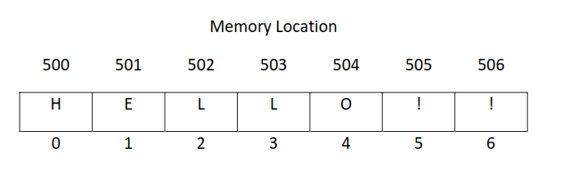

## Abstract Data Type

> - An `Abstract Data Type` (ADT) is a set of objects together with  
    a set of operations.

> - Abstract data types are mathematical concepts; nowhere in an ADT's  
    definition is there any mention of how the set of operations is  
    implemented.

> - Objects such as lists, sets, and graphs, along with their operations,  
    can be viewed as ADT's, just as integersm, reals, and Booleans are  
    data types.

> - Integers, floats, and Booleans have operations associated with them  
    and so do ADTs.

> - ADT is a mathematical model with a collection of operations defined  
    on model.

> - An ADT should have a `contract` (or specification) that:

| (1) Declaration of Data |
| ----------------------- |
| Specifies the set of values of the abstract data type. |

 

| (2) Declaration of Operations |
| ----------------------------- |
| Specifies each operations of the abstract data type   (i.e. specifies the operation's name, its parameter, types, results, etc. |

 

> - The noticeable behavior of an operation is the effect  
    of that operation as observed by the code.

> - Consider the example where there is an operation that  
    sorts a sequence of values.

> - The code that calls this operation will be able to  
    tell that the values has been sorted.

> - But cannot observe the detailed step-by-step by which  
    the operation achieves the result.

 
 

## Implementation

| An implementation of the Abstract Data Type requires: |
| ----------------------------------------------------- |
| - Choosing a data representation. |
| - Choosing a suitable algorithm for each of the operations. |

> - The chosen data representation must represent all possible  
    values of the Abstract Data type.

> - And the chosen algorithms must be consistent with the chosen  
    representation.

 
 

## Collection ADTs

| Examples |
| -------- |
| - A `stack` of plates in the dishwasher. |
| - A `queue` of customers in a restaurant. |
| - A `list` of places to visit. |
| - A `set` of items on a menu. |
| - A `table` of formulas for each problem. |
| - A family `tree`. |
| - A road `network`. |

> - This ADTs are know as `collections`.

> - A `collection` consists of zero or more elements (objects),  
    and is equipped with operations to add elements to the  
    collection, or to remove elements from the collection.

> - The elements of a given collection are typically all of the  
    same type.

> - Each kind of collection has its own unique properties.  

> - For example, the elements of stacks, queues, and lists have  
    a fixed order, while the elements of sets and maps have no  
    particular order.

> - As a result, each kind of collection is equipped with its  
    own characteristic operations.

> - A `stack` allows us to add and delete elements at the same  
    end only.

> - A `queue` allows us to add and delete elements at opposite  
    ends only.

> - A `list` allows us to add and remove elements at any given  
    location.

> - A set allows us simply to add and remove elements: its  
    elements have no particular order.

> - These collection ADTs can be represented by some data structures.

> - And some of the commonly used ADTs to represent collection  
    include: `Array`, `Linked List`, `Binary Trees`, and `Hash Tables`.

> - For example, `Array` is a sequential arrangement of data elements.

> - Thus, it can represent the stack by using the index associated  
    with each element.

> - Below are some example of `Data Structures`:

| (1) Array |
| --------- |
| It is a collection of items stored at the adjacent memory locations. |
| The idea is to store multiple objects of the same type together in   one structure. |
| Thus, making it easier to get the location of each element (values   or variables) by simply adding an offset to the initial value (i.e.   the memory allocation of the first element of the array) . |
| It is a sequential arrangement of data elements paired with the   index of the data element. |
|  |
| The image above is the visualization of a character array. |
| The index `0` denotes the first element of the array having the   memory location of `500` and value of `H`. |

 

| (2) Linked List |
| --------------- |
| A `linked list` is a linear data structure, in which the elements   are not stored at adjacent memory locations. |
| The elements in a linked list are linked using pointers. |
| Each data element contains a link to another element along with   the data present in it. |

 

| (3) Binary Tree |
| --------------- |
| Binary Trees are hierarchical data structures. |
| Thus, there is a topmost node which is called the root node. |
| It is a data structure where each data element can be   connected to maximum two other data elements and   it starts with a root node. |

 

| (4) Hash Table |
| -------------- |
| A data structure which is made of arrays associated with   each other using a hash function. |
| It retrieves values using keys rather than index from a   data element. |

 

| (5) Stack |
| --------- |
| It is a data structure which follows only to specific   order of operation. |
| LIFO (Last in First Out) or FILO (First in Last Out). |

 

| (6) Queue |
| --------- |
| It is similar to Stack but the the order of operation is   only FIFO (First in First Out). |
